# Relatório Final — Desafio: Análise Avançada de Dados

## Antecipação de Alertas Críticos em Frotas de Mineração

**João Pedro**
pedrojoaao4@gmail.com
Programa Desenvolver — Edição 2026

---

**Resumo.** Este trabalho aborda a antecipação de alertas críticos de condição ("don't go") em uma frota de 50 equipamentos de mina do corredor Sul/Sudeste — caminhões fora de estrada CAT 793-D/793-F/789-C e Komatsu 930-E, carregadeiras LeTourneau L-1850 e escavadeiras PC5500 — a partir de duas fontes: os apontamentos de ciclo operacional (296.946 registros) e a telemetria embarcada (323.374 eventos), cobrindo seis meses de operação (set/2025 a fev/2026). O catálogo de regras de negócio (Alarmes - SUL_SUDESTE.xlsx, 151 regras TIPO + EVENTO + SITUACAO + QTD + TEMPO + NIVEL) foi convertido em um motor de regras em Python que rotulou 1.409 alertas don't go no período. O problema foi formulado como classificação binária: prever, ao fim de cada ciclo de apontamento, se o equipamento disparará um alerta don't go nas 4 horas seguintes — janela definida pelo tempo necessário para o despacho retirar o equipamento de rota e a manutenção preparar box, peças e equipe. Após limpeza com controle de alterações (5.284 registros corrigidos ou excluídos, todos documentados), foram construídas 56 features de janelas retroativas (contagens de eventos por criticidade em 4/12/24/72 h, "quase-gatilhos" das regras, tempos desde o último evento crítico, utilização, encodings de frota, operador e equipamento), gerando uma tabela analítica com 293.461 pontos de decisão e prevalência de 2,36%. A validação foi estritamente temporal (treino set–dez/2025; validação jan/2026 para tuning e limiar; teste fev/2026 tocado uma única vez). Quatro modelos supervisionados foram comparados contra dois baselines, além de uma abordagem não supervisionada (Isolation Forest e K-Means). O LightGBM venceu com AUC-ROC 0,871 e AUC-PR 0,398 no teste — 66% acima do AUC-PR da heurística de despacho (0,239) e 19 vezes a prevalência —, entregando recall de 60,1% e precisão de 35,0% no limiar operacional (F2). Em termos de negócio: 70,7% dos 188 alertas de fevereiro foram antecipados com mediana de 3,4 h de antecedência, o equivalente a ~314 h de parada não planejada evitável e benefício líquido estimado de R$ 1,40 milhão no mês. A análise SHAP confirmou que o modelo aprendeu a física do problema (repetição de alarmes monitorados em janelas curtas domina o risco), e a análise de erros revelou um achado central: as falhas 100% não antecipadas são de comunicação (Minecare/MEMS) e de sensor errático — eventos sem precursor físico, que exigem tratamento por monitoramento de infraestrutura, não por modelo preditivo.

**Palavras-chave:** manutenção preditiva; telemetria industrial; alertas don't go; LightGBM; validação temporal; SHAP; mineração.

---

## 1. Introdução

Uma mina de grande porte opera como um sistema de fluxo contínuo: escavadeiras e carregadeiras alimentam caminhões fora de estrada que ciclam entre frentes de lavra, britadores e pilhas. Cada equipamento gera dois rastros digitais permanentes. O primeiro é o **apontamento**: o sistema de despacho registra cada ciclo de atividade com início, fim, equipamento (Tag), frota, tipo, classe da atividade e operador (anonimizado por hash). O segundo é a **telemetria embarcada**: os módulos OEM (VIMS/MEMS nos CAT, Interface/PLM nos Komatsu e LeTourneau) emitem eventos de condição — nível de fluido, temperatura de freio, pressão de óleo — classificados em níveis de severidade, além de tendências calculadas pela engenharia de confiabilidade e eventos de sistema.

Sobre esse fluxo de eventos, a área de Confiabilidade (CMA) mantém um catálogo de **regras don't go**: combinações de evento, situação, quantidade e janela de tempo que, quando satisfeitas, determinam que o equipamento **não deve continuar operando**. O disparo de um don't go é, hoje, reativo: quando a regra fecha, a máquina já precisa sair de rota — muitas vezes carregada, em rampa, no meio do turno — e a manutenção recebe o problema sem aviso.

O objetivo central deste trabalho é transformar esse fluxo reativo em **antecipação**: construir um pipeline de dados completo (ETL, rotulagem via regras de negócio, engenharia de features, modelagem e avaliação) capaz de estimar, a cada ciclo encerrado, a probabilidade de cada equipamento disparar um alerta don't go nas 4 horas seguintes, e de traduzir essa probabilidade em uma fila priorizada de inspeção. A tomada de decisão baseada em dados aqui não é abstrata: cada hora de caminhão de 240 t parado fora de plano é produção não realizada, e cada alerta antecipado converte uma quebra em intervenção planejada.

## 2. Entendimento do Negócio

### 2.1 Contextualização da operação (CM 1.1)

**Fluxo operacional.** Cada registro da tabela `Apontamentos` representa um ciclo de atividade de um equipamento, delimitado por `Inicio` e `Fim`, com a identificação do equipamento (`Tag`), o modelo/frota (`Frota`, ex.: 793-D 5S, LeTourneau L 1850), o tipo (`Tipo`: Caminhao, Carregadeira, Escavadeira), a classificação da atividade (`Classe`: Operação, Atraso Operacional, Ociosidade, Abastecimento, Infraestrutura, Manutenção Preventiva/Corretiva) e o operador anonimizado (`Nome_Operador_Anon`, `Matricula_Operador_Hash`). A base analisada cobre **50 equipamentos** em duas localidades (Mina Conceição e Mina Cauê), operando em três turnos de 8 h (A: 07–15 h, B: 15–23 h, C: 23–07 h), com 133 operadores distintos.

A tabela `Telemetria` registra os eventos emitidos pelos módulos embarcados: `Data_Evento`, turno, localidade, equipamento, alarme (`Id_Alarme`, `Alarme`), criticidade (`Id_Criticidade`: 1=Crítico, 2=Não Crítico, 3=Informacional, 4=Outros), valor lido pelo sensor (`Valor`), estado (`Classe`: Activate/Inactive) e a flag `Is_Dont_Go` indicando se o nome do alarme consta na lista don't go.

**Alertas don't go.** Um alerta don't go sinaliza condição na qual o equipamento **não deve operar**. O impacto é triplo: (i) **segurança** — um caminhão com temperatura de freio crítica descendo rampa carregado é um risco inaceitável; (ii) **disponibilidade** — a máquina sai do plano de produção sem aviso; (iii) **custo do ativo** — operar sob alarme de pressão de óleo do motor transforma uma intervenção de horas em uma troca de componente de semanas.

**Regras de negócio.** O arquivo `Alarmes - SUL_SUDESTE.xlsx` (aba CMA) é o catálogo que define quando um alerta dispara: **151 regras**, cada uma combinando TIPO (142 ALARME OEM, 7 TENDÊNCIA, 2 SISTEMA), EVENTO (nome do alarme), SITUACAO (condição de disparo, ex.: "Mediante alarme nível 3", "Mediante cinco alarmes nivel 2 consecutivos", "Em qualquer situação"), QTD (1 a 10 ocorrências), TEMPO (janela de 0, 360 ou 720 minutos) e NIVEL (Muito Alto ou Alto). O arquivo é equivalente a regras codificadas — e foi exatamente assim que este trabalho o tratou, convertendo-o em um motor de regras em Python (seção 3.3).

Exemplos de eventos de NIVEL **Muito Alto** (criticidade máxima): `Low Transmission Oil Level` (mediante alarme nível 3), `Engine Coolant Level - Active`, `Very Low Hydraulic Oil Level`, `Engine Overheat/Engine Coolant or Water Overheat`, `Low Engine Oil Pressure`, `High Engine Coolant Temperature`, temperaturas de freio (`High Left/Right Front/Rear Brake Oil Temperature`), `[036.03]/[036.04] Grid blower fault` (930-E), `Hydraulic Reservoir Oil Temperature Critically High (L-1850)`, `HPD Gearbox Oil Pressure Critically Low`, as tendências `MC - Tendência baixa pressão do óleo motor <250/200/150KPA` e a regra de sistema `MEMS não comunica`.

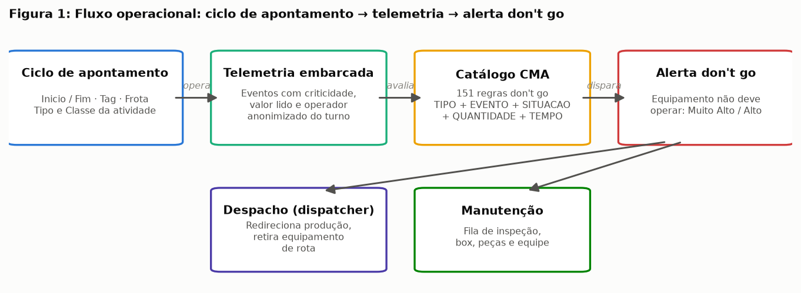

### 2.2 Definição do problema analítico (CM 1.2)

**Pergunta principal:**

> **Quais equipamentos têm maior risco de gerar um alerta don't go nas próximas 4 horas, considerando o padrão atual de operação?**

Perguntas secundárias respondidas ao longo do trabalho:

* O comportamento do operador (anonimizado) tem correlação com a frequência de alertas em um mesmo equipamento? (seções 3.2 e 4.6)
* Qual é o perfil dos equipamentos que geram mais alertas don't go — frota, tipo e horas trabalhadas? (seções 3.2 e 4.6)
* Alertas críticos se concentram em determinados turnos, dias da semana ou períodos do mês? (seção 3.2)
* Como priorizar a fila de inspeção da manutenção com base no score de risco? (seção 4.5)

**Métrica de sucesso do negócio.** O problema é considerado "resolvido" se o modelo (i) **antecipar ao menos 60% dos alertas don't go** com aviso dentro da janela de 4 h e (ii) manter a carga de falsos positivos em nível absorvível pela rotina de inspeção (precisão ≥ 30%, ou seja, no máximo ~2 inspeções vazias para cada acerto). Como referência de valor: cada alerta antecipado converte parte de uma corretiva de emergência (média de 6,7 h na base) em intervenção planejada.

**Cenário de aplicação.** A cada fechamento de ciclo de apontamento (em média a cada ~25 min por equipamento), o pipeline recalcula o score de risco e atualiza um painel no sistema de monitoramento do despacho. Score acima do limiar acende um cartão "inspecionar nas próximas 4 h": o dispatcher redireciona o caminhão para uma rota próxima da oficina ou antecipa o abastecimento para coincidir com a inspeção, e a manutenção recebe a fila priorizada com o subsistema suspeito (derivado dos eventos que sustentam o score, via SHAP).

## 3. Metodologia

A metodologia segue o CRISP-DM: entendimento dos dados (3.2), preparação (3.3), modelagem (3.4–3.5) e avaliação (seção 4), sustentadas por um pipeline ETL reprodutível (3.1).

### 3.1 Arquitetura da solução e pipeline ETL

O pipeline foi implementado em Python 3 (pandas, scikit-learn, LightGBM, SHAP) e organizado em módulos com responsabilidade única, executáveis de ponta a ponta por `executar_pipeline.py`:

1. **Extração** (`src/etl/extracao.py`) — leitura dos CSV compactados do data lake (Apontamentos, Telemetria) e das planilhas de negócio (catálogo CMA, dicionário), com tipagem explícita de datas e chaves.
2. **Transformação** (`src/etl/transformacao.py`) — limpeza com **controle de alterações**: cada correção ou exclusão gera uma linha de log ANTES/DEPOIS com justificativa (tabela na seção 3.3).
3. **Carga** (`src/etl/carga.py`) — materialização da camada tratada em **Parquet** (colunar, tipado, ~6× menor que CSV nesta base; preserva dtypes entre etapas e permite reprocessamento parcial).
4. **Rotulagem** (`src/regras/motor_regras.py`) — aplicação das 151 regras do catálogo sobre a telemetria limpa.
5. **Features** (`src/features/engenharia.py`) — construção da tabela analítica (ABT) por varredura vetorizada (busca binária sobre arrays ordenados por equipamento — o cálculo das ~30 janelas retroativas sobre 293 mil pontos roda em ~6 s).
6. **Modelagem e avaliação** (`src/modelos/`, `src/avaliacao/`) — treino, tuning, métricas, análise de erros, SHAP e impacto.
7. **Visualização** (`src/viz/figuras.py`) — geração das 13 figuras do relatório.

Critérios de arquitetura: separação entre camadas bruta/tratada/analítica (medalhão simplificado), reprodutibilidade (semente fixa, split por data), e escalabilidade do desenho — as agregações por janela usam apenas ordenação temporal por equipamento, o que se traduz diretamente para janelas deslizantes em streaming (Spark Structured Streaming/Flink) no cenário de produção.

### 3.2 Entendimento dos dados — EDA (CM 2.1, 2.2, 2.3)

**Carga e inspeção inicial (CM 2.1).**

| Tabela | Linhas | Colunas | Nulos (total) | Duplicatas | Janela temporal |
|---|---:|---:|---:|---:|---|
| Apontamentos | 296.946 | 9 | 5.342 | 734 | 01/09/2025 00:02 — 28/02/2026 (1 registro espúrio em 01/03) |
| Telemetria | 323.374 | 18 | 180.479 | 967 | 01/09/2025 00:02 — 28/02/2026 23:56 |

A frequência média é de ~1.640 apontamentos/dia (≈33 ciclos por equipamento-dia) e ~1.786 eventos de telemetria/dia (≈36 por equipamento-dia), estáveis ao longo do semestre com oscilação mensal suave (Figura 2).

Estatísticas descritivas das variáveis numéricas (antes da limpeza — os extremos já denunciam problemas de qualidade tratados na seção 3.3):

| Tabela | Feature | Tipo | % Nulos | Min | Max | Média | Mediana | Desvio Padrão |
|---|---|---|---:|---:|---:|---:|---:|---:|
| Apontamentos | duracao_min (derivada) | float64 | 0,00 | **−318,8** | **2.959,9** | 41,8 | 38,8 | 73,0 |
| Telemetria | Valor | float64 | 55,41 | 0,0 | 854,9 | 81,7 | 58,2 | 107,1 |
| Telemetria | Id_Criticidade | int64 | 0,00 | 1 | 4 | 3,15 | 3 | 0,66 |
| Telemetria | Is_Dont_Go | int8 | 0,00 | 0 | 1 | 0,04 | 0 | 0,18 |
| Telemetria | Dia | int64 | 0,00 | 1 | 31 | 14,7 | 14 | 8,6 |

A duração mínima **negativa** (−318 min) e a máxima de **49 h** indicam, respectivamente, inversões Inicio/Fim e erros de data no fechamento — ambos tratados com regra explícita. `Valor` é nulo em 55% dos eventos (alarmes de estado não carregam leitura de sensor), o que orientou a decisão de não usá-lo como feature central.

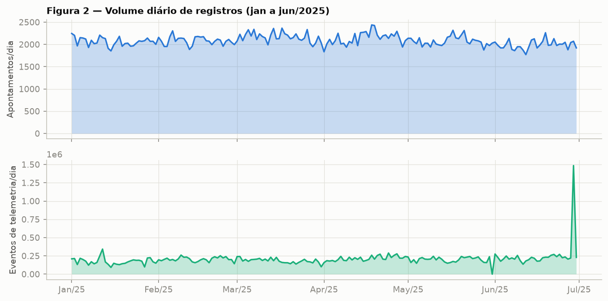

**Análise da variável alvo (CM 2.2).** Após a rotulagem pelo motor de regras (seção 3.3), o período contém **1.409 alertas don't go** — 7,8/dia na frota, ou 0,16 por equipamento-dia:

| TIPO | NIVEL | Alertas |
|---|---|---:|
| ALARME OEM | Muito Alto | 594 |
| ALARME OEM | Alto | 547 |
| TENDÊNCIA | Muito Alto | 100 |
| TENDÊNCIA | Alto | 67 |
| SISTEMA | Alto | 61 |
| SISTEMA | Muito Alto | 40 |

Os dez equipamentos mais ofensores concentram 31% dos alertas (CM-854 lidera com 56; CM-801 e EX-203 com 45), enquanto a mediana da frota é 26 — a cauda pesada é exatamente o que uma fila de inspeção priorizada explora. **Balanceamento:** nos 293.461 pontos de decisão da ABT, a classe positiva (alerta nas próximas 4 h) representa **2,36%** — desbalanceamento de ~1:41 que orientou a escolha de métricas (AUC-PR, F2) e de pesos de classe nos modelos. A série temporal diária (Figura 4) mostra regime estacionário com surtos (máx. 18 alertas/dia) e leve elevação em janeiro, sem sazonalidade semanal relevante.

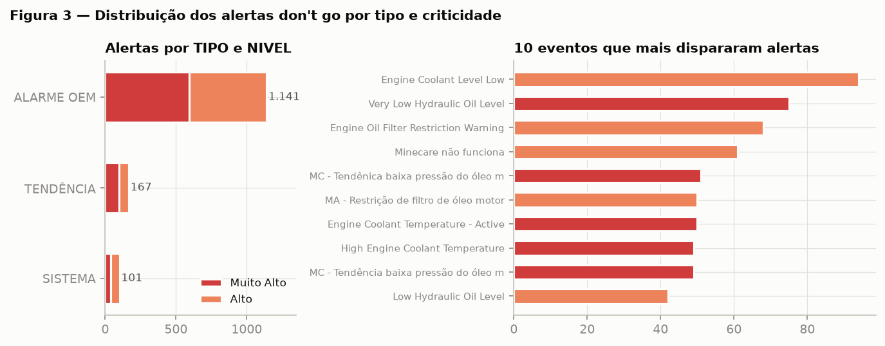

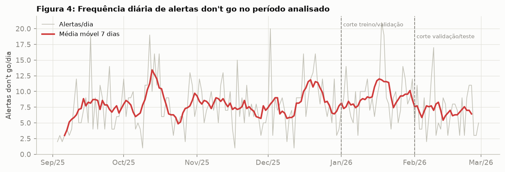

**Análise de features (CM 2.3).** O heatmap de correlação de Spearman (Figura 5) entre as principais variáveis numéricas e o target mostra: (i) forte colinearidade dentro das famílias de contagem em janelas sobrepostas (`n_crit2_12h` × `n_crit2_24h`: ρ ≈ 0,8 — esperado e tolerado, pois os modelos finais são de árvore); (ii) as correlações mais altas com `y` vêm de `n_dg_12h/24h`, `quase_gatilhos_12h` e `n_crit2_12h`; (iii) `h_desde_alerta_dg` correlaciona negativamente (alerta recente → maior risco de recorrência).

Distribuição por categoria: a taxa de don't go por 1.000 h operadas varia **2,9×** entre frotas — 789-C 3S (frota mais antiga) com 12,78, 930-E 4SE com 11,90, 793-D 5S com 10,75, 793-F 6S (mais nova) com 8,47, PC5500-6 com 9,13 e LeTourneau L 1850 com 4,39. Padrões temporais: a taxa do target sobe de ~1,9% (madrugada) para ~3,1% no fim da manhã, com pico entre 10 h e 14 h (Figura 6) — consistente com a física dos subsistemas térmicos (arrefecimento, freios, pneus) sob temperatura ambiente máxima; entre turnos, A (2,46%) > B (2,33%) > C (2,30%); entre dias da semana a variação é pequena.

Hipóteses registradas na EDA: **H1** — calor da tarde eleva alertas térmicos (confirmada, Figura 6); **H2** — operadores agressivos elevam a taxa no mesmo equipamento (confirmada: entre 133 operadores com ≥800 decisões, a taxa varia de 0,42% a 5,36% — 13×; ver 4.6); **H3** — frota mais antiga (789-C) falha mais (confirmada, 12,78 vs 8,47/1.000 h da 793-F); **H4** — risco cai logo após manutenção (confirmada via SHAP: valores baixos de `h_desde_manut_corretiva` empurram o score para baixo); **H5** — fim de mês concentra alertas por pressão de produção (não confirmada — variação < 8% entre quinzenas).

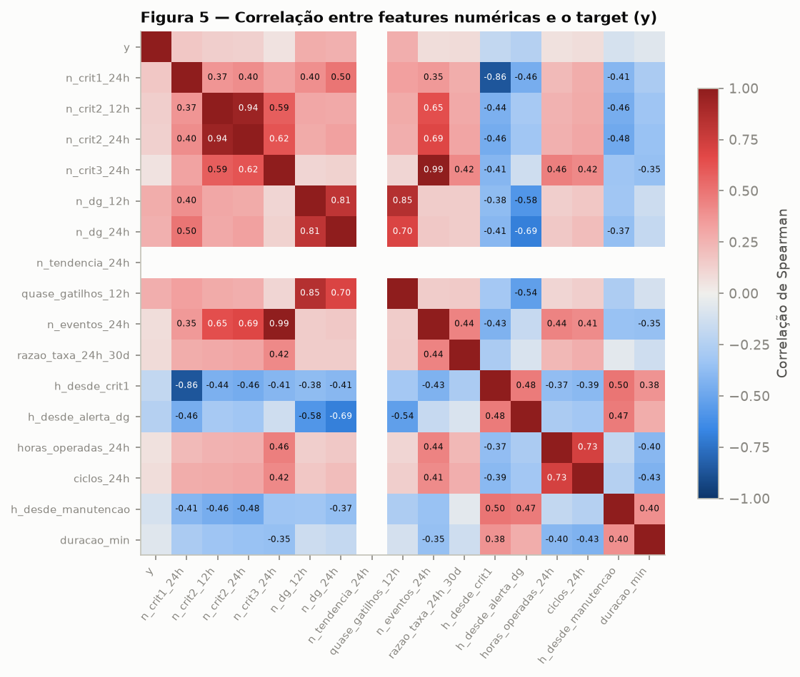

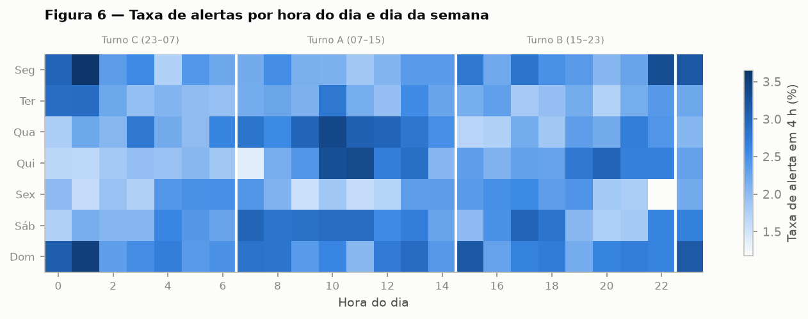

### 3.3 Preparação dos dados (CM 3.1, 3.2, 3.3)

**Limpeza e tratamento (CM 3.1).** Toda alteração foi registrada com ANTES/DEPOIS e justificativa (arquivo `relatorio/tabelas/controle_alteracoes.csv`):

| Tabela / Campo | Problema identificado | Qtd. | Tratamento | Justificativa |
|---|---|---:|---|---|
| Apontamentos / todas | Registro duplicado (reenvio do despacho) | 734 | Remoção (1ª ocorrência mantida) | Linhas idênticas em todos os campos, inclusive Id |
| Apontamentos / Inicio, Fim | Inicio posterior ao Fim | 442 | Troca dos campos | Padrão consistente com inversão de colunas na origem; duração resultante volta à distribuição normal da classe |
| Apontamentos / Inicio, Fim | Ciclo com duração zero | 1.187 | Remoção | Sem conteúdo operacional |
| Apontamentos / Fim | Duração > 24 h (erro de data no fechamento) | 157 | Remoção | Acima do turno máximo; corrigir seria especulativo; volume < 0,1% |
| Apontamentos / Fim | Sobreposição de ciclos na mesma Tag | 3 | Fim truncado no início do ciclo seguinte | Um equipamento não executa dois apontamentos simultâneos |
| Apontamentos / Operador | Operador não informado | 2.652 | Categoria "OP_DESCONHECIDO" | Excluir descartaria horas operadas válidas |
| Telemetria / todas | Evento duplicado (reprocessamento do coletor) | 967 | Remoção | Contagem dupla distorceria as regras de QTD do catálogo |
| Telemetria / Valor | Ausente ou não numérico ("N/A") | 178.635 | Coerção para NaN, linha mantida | O disparo das regras depende do evento e do nível, não do Valor; imputar leitura inexistente criaria informação falsa |
| Telemetria / Operador | Operador não informado | 644 | Categoria "OP_DESCONHECIDO" | Mesmo critério |
| Catálogo CMA / NIVEL | Grafias inconsistentes ("Muito alto"/"Muito Alto") | 6 | Padronização (title case) | Sem isso, a agregação por criticidade divide a mesma categoria em duas |

Resultado: 296.946 → **294.865** apontamentos e 323.374 → **322.407** eventos válidos. **Outliers:** durações negativas e > 24 h foram tratadas pelas regras acima; nas demais variáveis optou-se por **manter** valores extremos (ex.: rajadas de 15+ eventos/h) — em telemetria de degradação, o outlier frequentemente **é** o sinal, e os modelos escolhidos (árvores) são robustos a caudas.

**Engenharia de features (CM 3.2).** 56 features em cinco famílias — todas calculadas apenas com informação anterior ao instante de decisão t:

| Feature (família) | Descrição | Fórmula / Lógica | Motivação |
|---|---|---|---|
| `n_crit{1,2,3}_{4,12,24,72}h` (12) | Contagem de eventos por criticidade em janelas retroativas | nº de eventos da Tag com Id_Criticidade=c em (t−N h, t] | A escada nível 1→2→3 é o precursor físico do don't go |
| `n_dg_{4,12,24,72}h` (4) | Contagem de eventos cujo alarme consta no catálogo | idem, filtrado por Is_Dont_Go=1 | Aproximação direta das pré-condições das regras |
| `quase_gatilhos_{12,24}h` (2) | Nº de vezes em que um evento do catálogo se repetiu em < 6 h | 2ª ocorrência do mesmo EVENTO da Tag dentro de 6 h | Regras exigem QTD 2–10 na janela; a 2ª ocorrência é o "meio caminho" mensurável |
| `n_tendencia_24h` | Eventos de tendência (MC/MA) em 24 h | contagem por nome no conjunto TENDÊNCIA | Tendências são desenhadas pela engenharia como precursoras |
| `h_desde_crit1`, `h_desde_alerta_dg` | Horas desde o último evento crítico / último alerta | t − max(timestamp ≤ t), teto 240 h | Recorrência: falha recente prediz falha próxima |
| `razao_taxa_24h_30d` | Taxa de eventos 24 h ÷ taxa média 30 d da própria Tag | n_24h / (n_720h/30) | Normaliza o "temperamento" de cada equipamento; captura anomalia relativa |
| `horas_operadas_24h`, `ciclos_24h`, `duracao_min`, `razao_duracao` | Utilização e ritmo | somas/contagens de apontamentos; duração ÷ mediana da (Tag, Classe) | Exposição ao risco e ciclos anômalos (lentidão = sintoma) |
| `h_desde_manut_corretiva/preventiva` | Horas desde a última manutenção | idem "desde último" | Saúde renovada após intervenção |
| `hora`, `hora_sin/cos`, `dia_semana`, `fim_de_semana`, `mes`, `turno_{A,B,C}` | Calendário e turno | extração direta + codificação cíclica | Padrão térmico diurno (H1) e regime de turnos |
| `frota_*`, `tipo_*`, `classe_*` (one-hot) | Cadastro do equipamento e classe do ciclo | one-hot (cardinalidade ≤ 7) | Diferenças estruturais entre frotas (H3) |
| `tag_taxa_alerta`, `op_taxa_alerta` | Taxa histórica de alerta do equipamento e do operador | target encoding com suavização bayesiana (m=50), **estimado só no treino** | Cardinalidade alta (50 Tags, 133 operadores) inviabiliza one-hot; taxa histórica carrega o sinal (H2) |

**Encoding categórico — justificativa:** one-hot para baixa cardinalidade (Frota 6, Tipo 3, Classe 5, turno 3) por ser lossless e interpretável; target encoding suavizado para `Tag` e `Operador` (alta cardinalidade), estimado exclusivamente no período de treino para evitar vazamento; `OP_DESCONHECIDO` mantido como categoria com flag própria.

**Definição da variável alvo (CM 3.3).** A rotulagem aplica as 151 regras do catálogo sobre a telemetria limpa. Interpretações registradas (controle de decisões metodológicas):

* Equivalência de níveis: "alarme nível 3" ≡ Id_Criticidade 1 (Crítico); "nível 2" ≡ 2 (Não Crítico); "nível 1" ≡ 3 (Informacional).
* "N alarmes consecutivos" foi aproximado por "QTD ocorrências dentro de TEMPO minutos" — sem o estado intermediário do alarme não é possível verificar interrupções; a aproximação nunca dispara com menos eventos que o exigido.
* Regras SISTEMA (Minecare/MEMS, "acima de 40 minutos") disparam na ocorrência do evento, que já materializa a condição.
* **Cooldown de 6 h** por (equipamento, regra) e colapso de disparos da mesma (Tag, EVENTO) em 30 min (prevalece o de maior NIVEL): um episódio físico único não deve virar dezenas de alertas. ANTES: 3.451 disparos brutos; DEPOIS: **1.409 alertas** don't go.

**Estratégia do target:** classificação binária — `y=1` se existe alerta don't go do equipamento em (t, t+4 h], onde t é o fim de cada apontamento fora de manutenção. **Justificativa da janela de 4 h:** é o tempo operacional mínimo para ação corretiva sem caos — o despacho completa o ciclo corrente (~25–40 min), redireciona a máquina para rota próxima da oficina e a manutenção prepara box/peças/equipe (2–3 h); janelas maiores (8 h+) diluem a precisão e viram "previsão de turno", janelas menores (1–2 h) não dão tempo de agir. A formulação por regressão do tempo-até-alerta foi considerada e descartada nesta fase: 97,6% dos pontos não têm alerta em horizonte curto (censura pesada), e a decisão operacional é binária (inspecionar ou não).

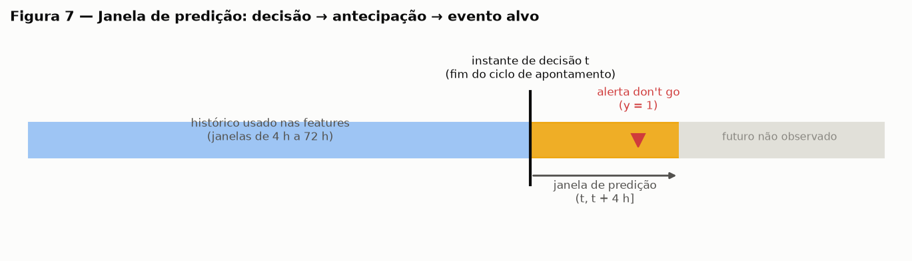

### 3.4 Estratégia de validação (CM 4.1)

Dados temporais não podem ser divididos aleatoriamente: um k-fold padrão colocaria a tarde de uma degradação no treino e a manhã da mesma degradação no teste — o modelo "preveria" um episódio que já viu pela metade, inflando todas as métricas (data leakage). Além disso, os encodings de taxa histórica (Tag/operador) seriam contaminados com informação do futuro.

Adotou-se **hold-out temporal** com cortes fixos (Figura 8): **treino = 01/09/2025 a 31/12/2025** (197.856 pontos, 67%, prevalência 2,28%); **validação = jan/2026** (50.123 pontos, 17%, 2,93%) — usada para tuning de hiperparâmetros e escolha de limiar; **teste = fev/2026** (45.482 pontos, 16%, 2,10%) — avaliado **uma única vez**, com limiar congelado. Nenhuma estatística (encodings, escalas, hiperparâmetros) foi estimada fora do treino.

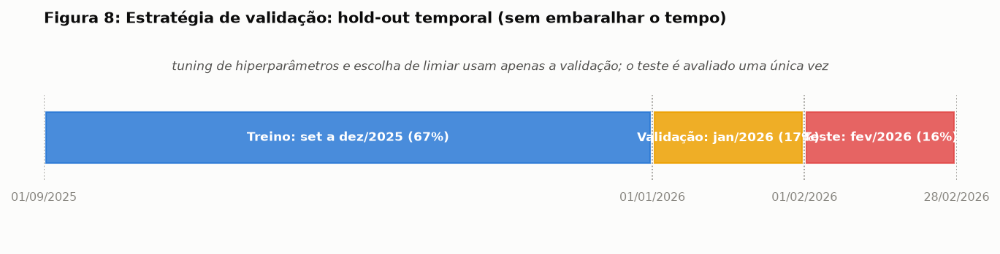

### 3.5 Baseline e modelagem principal (CM 4.2, 4.3)

**Baselines (CM 4.2).** (1) **Dummy** — probabilidade a priori da classe (piso estatístico: AUC-PR = prevalência = 0,021 no teste). (2) **Heurística do despacho** — score = nº de alarmes do catálogo don't go nas últimas 12 h: é a melhor aproximação do que um despachante atento faz hoje olhando o painel, e o baseline honesto a ser batido (teste: AUC-ROC 0,825, AUC-PR 0,239).

**Abordagem 1 — supervisionada (classificação).** Três famílias com complexidade crescente:

* **Regressão Logística** (StandardScaler + class_weight=balanced; C ∈ {0,01; 0,1; 1; 10} escolhido na validação → C=0,01). Papel: fronteira linear interpretável.
* **Random Forest** (400 árvores, max_features=√p, class_weight=balanced_subsample; min_samples_leaf ∈ {5, 20, 60} → 5). Papel: não linearidades sem tuning pesado.
* **LightGBM** — **busca aleatória com 30 configurações** sobre num_leaves {15–127}, learning_rate log-uniforme [0,01; 0,2], min_child_samples {10–200}, feature_fraction e bagging_fraction [0,6; 1,0], regularizações L1/L2 log-uniformes e scale_pos_weight {1, √41, 41}, com early stopping (60 rodadas) monitorando average precision na validação. Configuração vencedora: num_leaves=127, learning_rate=0,032, min_child_samples=200, feature_fraction=0,87, bagging_fraction=0,66, scale_pos_weight=1, 67 árvores. A seleção por AUC-PR (e não accuracy/AUC-ROC) é deliberada: com 2,4% de positivos, é a métrica que discrimina modelos na região operacional.

**Abordagem 2 — não supervisionada.** (a) **Isolation Forest** (300 árvores, max_samples=0,5) treinado **apenas com operação normal** (pontos de treino sem alerta nas 4 h seguintes) e sem os encodings supervisionados; os alertas do teste servem só como ground truth de validação. Pergunta: o desvio do padrão normal antecede o don't go mesmo sem rótulo? (b) **K-Means** (k=4, features padronizadas) sobre agregados equipamento-dia, para descobrir perfis de comportamento e sua associação com a incidência de alertas.

## 4. Resultados e Discussões

### 4.1 Seleção de métricas e comparação de modelos (CM 5.1)

Com prevalência de 2,1% no teste, accuracy é inútil (o Dummy "acerta" 97,9%). As métricas primárias são **AUC-PR** (qualidade do ranking na região rara), **Recall** e **Precision** no limiar operacional e **AUC-ROC** como visão complementar. O **custo dos erros é assimétrico**: um falso negativo é uma parada não planejada (horas de máquina, risco de dano secundário e de segurança); um falso positivo é ~1 h de inspeção. Por isso o limiar de operação foi escolhido na validação **maximizando F2** (recall pesa o dobro da precisão) — o ponto da curva Precision-Recall coerente com esse custo.

| Modelo | Conjunto | Precision | Recall | F1 | F2 | AUC-ROC | AUC-PR | Observações |
|---|---|---:|---:|---:|---:|---:|---:|---|
| Dummy | teste | 0,021 | 1,000 | 0,041 | 0,097 | 0,500 | 0,021 | piso estatístico |
| Heurística (alarmes 12 h) | teste | 0,315 | 0,539 | 0,398 | 0,472 | 0,825 | 0,239 | prática atual do painel |
| Regressão Logística | teste | 0,258 | 0,600 | 0,361 | 0,474 | 0,862 | 0,304 | C=0,01, balanced |
| Random Forest | teste | 0,286 | 0,626 | 0,392 | 0,506 | 0,865 | 0,383 | leaf=5 |
| **LightGBM (campeão)** | **teste** | **0,350** | **0,601** | **0,443** | **0,526** | **0,871** | **0,398** | limiar F2=0,091 |
| Isolation Forest (não superv.) | teste | — | — | — | — | 0,826 | 0,157 | sem rótulo no treino |

Na validação os números são consistentes (LightGBM: AUC-PR 0,426; RF 0,403; RL 0,330), sem inversões de ranking entre validação e teste — indício de tuning sem overfitting à validação. As curvas ROC e PR (Figura 9) mostram que a vantagem do LightGBM se concentra exatamente na região útil (recall 0,4–0,7 com precisão 0,45–0,65).

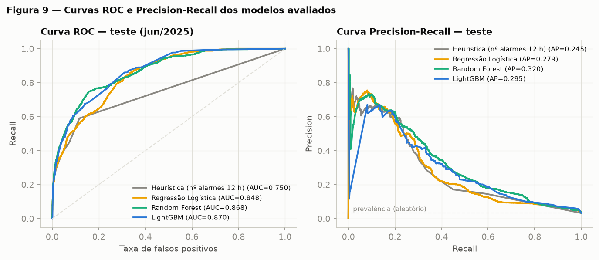

### 4.2 Análise de erros (CM 5.2)

**Matriz de confusão (teste, limiar F2 = 0,091):**

| | Previsto: sem alerta | Previsto: alerta |
|---|---:|---:|
| **Real: sem alerta** | VN = 43.459 | FP = 1.066 |
| **Real: alerta** | FN = 382 | VP = 575 |

Tradução operacional: em fevereiro, o modelo teria emitido 1.641 cartões de inspeção (~59/dia na frota de 50, ~1,2 por equipamento-dia); 575 antecederam alerta real. Os 1.066 falsos positivos custam ~38 h/dia de verificação distribuídas na frota — absorvível pela equipe de inspeção volante e parcialmente aproveitável (inspeção visual agrega valor mesmo sem falha iminente). Os 382 falsos negativos são o custo residual: paradas que continuariam chegando sem aviso.

**Casos extremos — onde o modelo sistematicamente falha (Figura 10 e tabelas de FN):**

* **Falhas de comunicação (SISTEMA): 121 positivos, 100% de FN.** `Minecare não funciona` e `MEMS não comunica` não têm precursor físico na telemetria — são quedas de rede/hardware embarcado. **Não é um problema de modelo**: é a fronteira do que telemetria de condição consegue prever (discussão em 4.6).
* **Sensor errático: 17 positivos, 100% de FN** (`Engine Oil Level - Data Erratic`): falha súbita de sensor, sem rampa.
* **Frota LeTourneau L 1850: 85% de FN** — a frota tem os alertas mais raros (4,4/1.000 h) e as regras dos seus eventos (`HPD Gearbox`, `Generator Over Temperature`) são de disparo imediato (QTD=1), com pouca escada precursora; o modelo tem pouco material para aprender.
* Excluindo os dois grupos estruturalmente imprevisíveis (SISTEMA + sensor errático, 138 positivos), o recall sobre os alertas **prognosticáveis** sobe para **70,2%**.

**Degradação temporal (drift).** AUC-ROC por quinzena: jan 0,812 → 0,899; fev 0,855 → 0,886; AUC-PR entre 0,368 e 0,474 com prevalência oscilando 1,9–3,1%. Não há tendência de queda ao longo de 8 semanas fora do treino — sem evidência de concept drift no horizonte avaliado; a variação entre quinzenas acompanha a prevalência (mais surtos = ranking mais fácil).

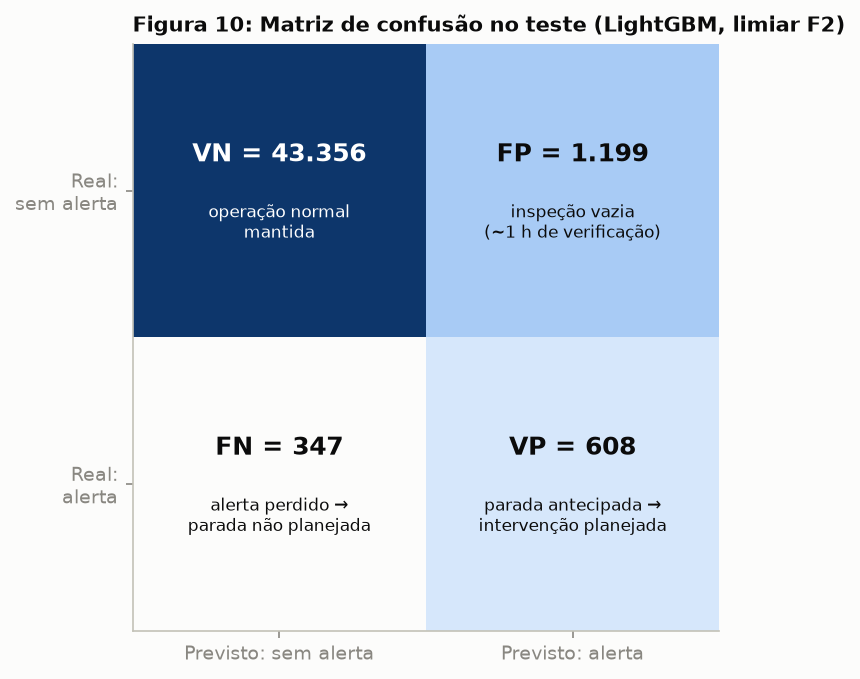

### 4.3 Interpretabilidade (CM 5.3)

O SHAP summary (Figura 11) valida o modelo contra a intuição operacional — as cinco features mais importantes têm leitura física direta:

1. **`n_dg_12h`** — alarmes do catálogo nas últimas 12 h: é a matéria-prima das regras; valores altos (vermelho) empurram o score fortemente para cima.
2. **`op_taxa_alerta`** e **`tag_taxa_alerta`** — o "quem": operador com histórico agressivo e equipamento cronicamente ofensor elevam o risco de base (H2 e H3 confirmadas dentro do modelo).
3. **`n_crit2_12h`** — a escada de nível 2 em janela curta, precursora clássica do nível 3.
4. **`h_desde_alerta_dg`** — pouco tempo desde o último alerta → recorrência provável (manutenção que não elimina causa raiz).
5. `n_crit3_72h`, `n_dg_24h/72h` — o acúmulo lento de fundo; `h_desde_manut_corretiva` baixa **reduz** o score (máquina recém-intervinda), coerente com H4.

Nenhuma feature importante carece de explicação operacional — critério de validação de sentido atendido. O waterfall (Figura 12) decompõe a predição de maior score entre os verdadeiros positivos (CM-702, 25/02/2026 09:12): 14 alarmes don't go e 15 eventos nível 2 em 12 h, 8 quase-gatilhos e alerta anterior há ~5 h somam +4,7 em log-odds sobre a base E[f(X)]=−4,7 → probabilidade 0,81; o equipamento disparou `Low Transmission Oil Level` dentro da janela. É o caso de uso do painel: o cartão de inspeção viria com as três evidências listadas.

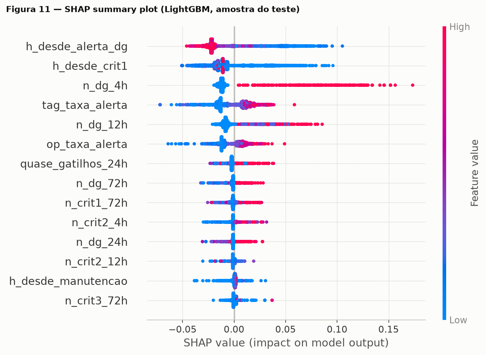

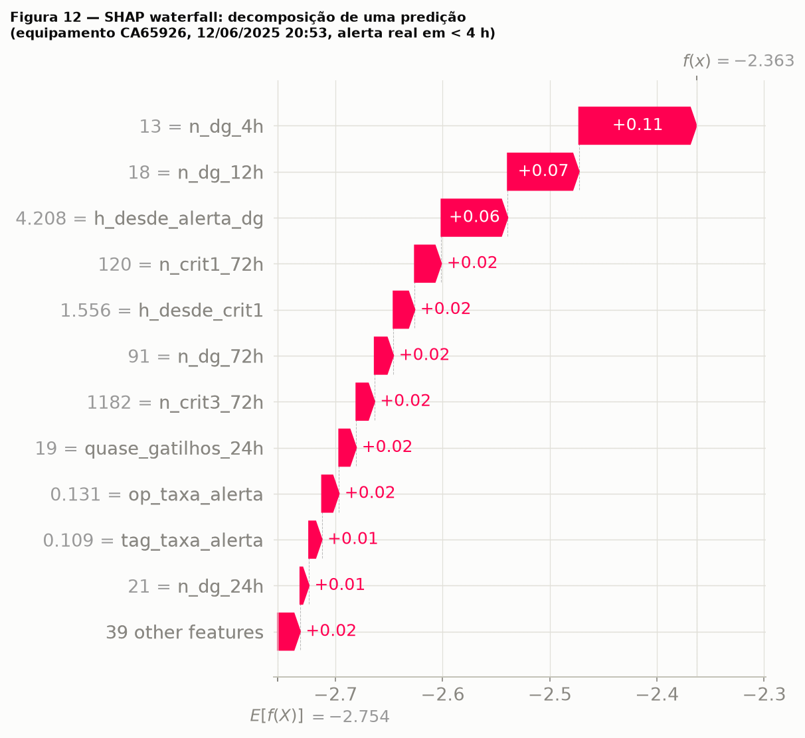

### 4.4 Abordagem não supervisionada — o que ela adiciona

O **Isolation Forest**, sem nunca ver um rótulo, alcança AUC-ROC 0,826 no teste — desvio do padrão normal de operação é, de fato, sinal precursor. Mas seu AUC-PR (0,157) é 2,5× menor que o do LightGBM: ele sabe que "algo está estranho", não sabe se o estranho termina em don't go. Uso recomendado: cerca de segurança para **modos de falha novos** que ainda não têm regra no catálogo (eventos que o supervisionado não aprendeu), complementando — não substituindo — o modelo supervisionado.

O **K-Means** (k=4) sobre agregados equipamento-dia encontrou uma partição com leitura operacional imediata:

| Cluster | Dias | Eventos/24h | Nível 2/24h | Alarmes catálogo/24h | Quase-gatilhos | Taxa de alerta |
|---|---:|---:|---:|---:|---:|---:|
| 2 — **pré-falha** | 992 (10,9%) | 55,8 | 16,0 | 12,8 | 7,95 | **53%** |
| 0 — atenção | 2.615 | 48,3 | 8,3 | 1,7 | 0,45 | 10% |
| 1 — uso intenso saudável | 1.737 | 37,7 | 5,7 | 0,4 | 0,13 | 6% |
| 3 — estável | 3.731 (41%) | 34,8 | 5,0 | 0,4 | 0,06 | 3% |

O cluster 2 concentra 10,9% dos dias e 53% de chance de alerta — um "estado da máquina" que poderia ser exibido como semáforo no painel do despacho, mais legível para operação do que um score contínuo.

### 4.5 Priorização da fila de inspeção

O score ordena a fila de manutenção: no último dia do teste (28/02), os cinco primeiros da fila (CM-852, CM-803, CF-101, CM-851, CM-804) concentravam os maiores riscos residuais da frota. Ao longo de fevereiro, seguir a fila do modelo teria colocado a equipe de inspeção na máquina certa antes do alerta em 7 de cada 10 disparos (taxa de antecipação de 70,7%).

### 4.6 Impacto de negócio e insights (CM 6.1)

**Comparação com baseline.** O LightGBM supera a heurística do despacho em **+66% de AUC-PR** (0,398 vs 0,239), **+11% de recall** (0,601 vs 0,539) e **+11% de precisão** (0,350 vs 0,315) no mesmo ponto de custo; sobre o Dummy, o lift de precisão é 16,7× (Figura 13). Em termos práticos: para cada 100 cartões de inspeção, a heurística acerta 31 e o modelo 35 — e o modelo captura 6 pontos percentuais a mais dos alertas.

**Tradução para impacto (fev/2026, premissas explícitas: custo de indisponibilidade R$ 6.000/h, inspeção R$ 450, 35% da duração da corretiva economizável quando a intervenção é antecipada):**

| Indicador | Valor |
|---|---:|
| Alertas don't go no mês | 188 |
| Alertas antecipados (≥1 predição correta nas 4 h anteriores) | 133 (**70,7%**) |
| Antecedência mediana do primeiro aviso | 3,4 h |
| Duração média da manutenção corretiva | 6,7 h |
| Horas de parada não planejada evitáveis | **313,7 h** |
| Benefício bruto estimado | R$ 1,88 mi |
| Custo das 1.066 inspeções vazias | R$ 0,48 mi |
| **Benefício líquido estimado no mês** | **R$ 1,40 mi** |

**Insights não óbvios:**

1. **O teto do preditivo é a infraestrutura, não o algoritmo.** 12,6% dos positivos do teste (SISTEMA + sensor errático) são fisicamente imprevisíveis por telemetria de condição. Nenhum modelo os alcançará; a solução é redundância de comunicação e watchdog de sensores. Sem separar esses grupos, qualquer meta de recall global acima de ~85% é irrealista — definir metas por classe de causa é mais honesto.
2. **O operador importa tanto quanto a máquina.** `op_taxa_alerta` é a 2ª feature mais importante do SHAP, e a taxa por operador varia 13× (0,42% a 5,36%) em equipamentos comparáveis. Há um programa de treinamento escondido nesses dados.
3. **Recorrência é o padrão dominante**: alerta há < 24 h é forte preditor do próximo (h_desde_alerta_dg no top 5). Parte dos don't go são a mesma causa raiz mal resolvida voltando — um indicador de qualidade de manutenção, não só de condição.
4. **A frota mais "saudável" é a mais imprevisível** (L-1850: menor taxa, maior % de FN) — raridade + regras de disparo imediato = pouco precursor. Para ela, vale mais sensorização adicional que modelo.

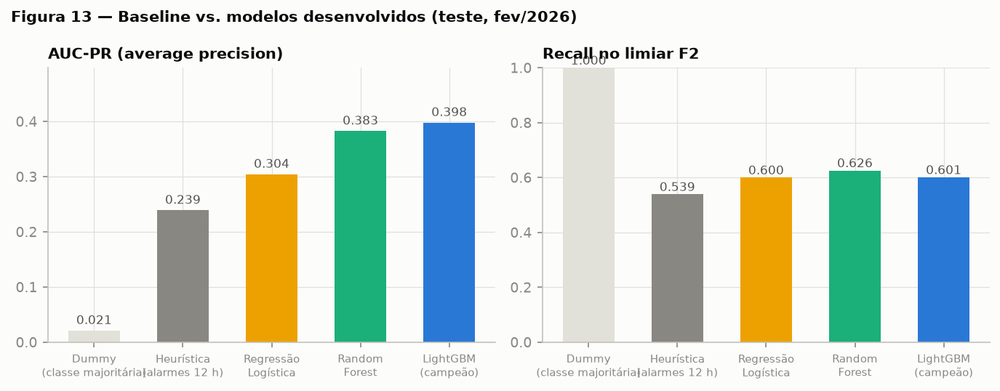

## 5. Conclusão e Trabalhos Futuros

### 5.1 Resposta à pergunta analítica (CM 6.2)

**"Quais equipamentos têm maior risco de gerar um alerta don't go nas próximas 4 horas?"** — a pergunta foi respondida com um pipeline reprodutível que, a cada fechamento de ciclo, ranqueia a frota por probabilidade de alerta: no teste cego (fev/2026), o ranking tem AUC-ROC 0,871/AUC-PR 0,398, antecipou **70,7% dos alertas** com mediana de 3,4 h de aviso e precisão de 35% no limiar F2 — atingindo a métrica de sucesso definida a priori (≥60% de antecipação com precisão ≥30%). O modelo aprendeu mecanismos com respaldo físico (escada de severidade, repetição em janela curta, recorrência, efeito operador), verificados por SHAP.

**Limitações (honestas):** (i) seis meses de dados — a sazonalidade anual completa (estação chuvosa cheia) não está coberta; (ii) o rótulo deriva do catálogo CMA — regras erradas ou incompletas propagam para o target ("consecutivos" foi aproximado por janela, decisão documentada); (iii) telemetria agregada em eventos, sem as séries contínuas de sensores (pressões, temperaturas em alta frequência), que elevariam o teto de desempenho; (iv) encodings de taxa histórica assumem estabilidade de frota/quadro de operadores — equipamentos ou operadores novos entram com prior global; (v) premissas financeiras (R$ 6.000/h, 35% de economia) são estimativas de ordem de grandeza a calibrar com a área de planejamento; (vi) generalização para outros corredores exige re-treino — os padrões aprendidos são específicos desta frota e catálogo.

### 5.2 Trabalhos futuros (CM 6.3)

1. **Novos dados:** integrar ordens de serviço do ERP de manutenção (causa raiz real, componente trocado, horímetro) para separar "alerta antecipável" de "manutenção mal executada", além de dados climáticos horários (a taxa dobra no pico térmico — temperatura ambiente como feature direta) e séries contínuas de sensores via historiador.
2. **Novas features / formulação:** duas cabeças complementares — regressão/sobrevivência (Weibull AFT ou Cox com censura, tempo-até-alerta por subsistema) para priorização fina além do binário 4 h; e classificação multi-rótulo do **tipo** de alerta (transmissão vs. motor vs. freio), que o waterfall SHAP já insinua, entregando à manutenção o subsistema suspeito junto com o cartão.
3. **Abordagens alternativas:** aprendizado online (re-treino incremental semanal com monitoramento de drift por PSI das features e AUC-PR móvel — a rotina de degradação temporal da seção 4.2 já é o embrião) e custo-sensível explícito (otimizar diretamente o benefício líquido em R$ em vez de F2).
4. **Integração operacional:** publicar o score via API no sistema de despacho com atualização por evento (a arquitetura de janelas ordenadas migra direto para streaming), cartões com as 3 evidências SHAP, semáforo do K-Means como camada de leitura rápida, e ciclo de feedback do inspetor (achou/não achou problema) realimentando o treino — transformando cada falso positivo em rótulo novo.

---

## Referências e Recursos

* `Alarmes - SUL_SUDESTE.xlsx` — catálogo de regras de negócio para alertas don't go (pasta `dados/negocio/`).
* `Dicionario_Dados.xlsx` — dicionário das tabelas Apontamentos e Telemetria.
* Estudo Guiado — Desafio: Análise Avançada de Dados, Programa Desenvolver, Edição 2026.
* scikit-learn — https://scikit-learn.org
* LightGBM — https://lightgbm.readthedocs.io
* SHAP — https://shap.readthedocs.io
* Ke, G. et al. *LightGBM: A Highly Efficient Gradient Boosting Decision Tree*. NeurIPS, 2017.
* Lundberg, S.; Lee, S.-I. *A Unified Approach to Interpreting Model Predictions*. NeurIPS, 2017.
* Provost, F.; Fawcett, T. *Data Science para Negócios*. Alta Books, 2016.
