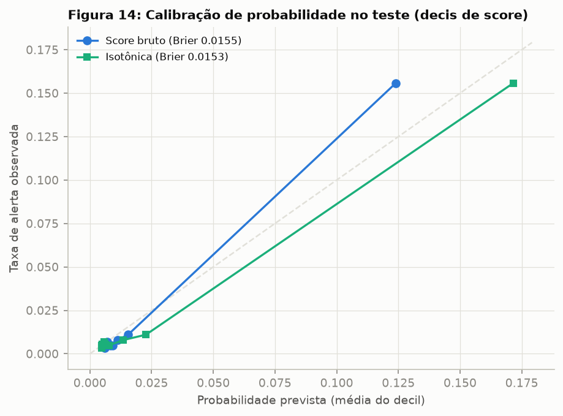
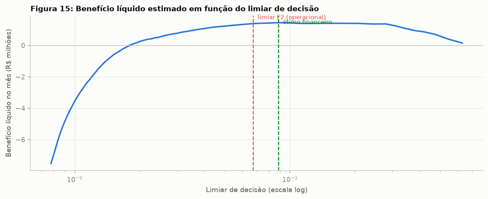

# Relatório Final: Desafio Análise Avançada de Dados

## Antecipação de Alertas Críticos em Frotas de Mineração

**João Pedro Costa**
pedrojoaao4@gmail.com
Programa Desenvolver, Edição 2026

---

**Resumo.** Este trabalho aborda a previsão e a prevenção de alertas críticos de condição ("don't go") em uma frota de 50 equipamentos de mina do corredor Sul/Sudeste, composta por caminhões fora de estrada CAT 793-D, 793-F e 789-C, caminhões elétricos Komatsu 930-E, carregadeiras LeTourneau L-1850 e escavadeiras PC5500. Foram utilizadas duas fontes: os apontamentos de ciclo operacional (296.946 registros) e a telemetria embarcada (323.374 eventos), cobrindo seis meses de operação (setembro/2025 a fevereiro/2026). O catálogo de regras de negócio (aba CMA do arquivo Alarmes - Regra de Negocio_V2.xlsx, 151 regras definidas por TIPO, EVENTO, SITUACAO, QUANTIDADE, TEMPO e NIVEL) foi convertido em um motor de regras em Python, que rotulou 1.409 alertas don't go no período; a coluna Is_Dont_Go da telemetria foi usada apenas como pré-filtro de elegibilidade, e o rótulo oficial foi recalculado a partir das regras, considerando a quantidade de ocorrências dentro da janela de tempo em minutos. O problema foi formulado como classificação binária: prever, ao fim de cada ciclo de apontamento, se o equipamento disparará um alerta don't go nas 4 horas seguintes, janela sustentada por análise de sensibilidade (2, 4 e 8 horas) e pelo tempo de reação do despacho e da manutenção. Após limpeza com controle de alterações integral, foram construídas 56 variáveis de janelas retroativas, gerando uma tabela analítica com 293.465 pontos de decisão e prevalência de 2,37%. A validação foi estritamente temporal (treino de setembro a dezembro, validação em janeiro, teste em fevereiro, avaliado uma única vez), complementada por validação walk-forward em cinco dobras mensais, que confirmou estabilidade (AUC-PR entre 0,358 e 0,426, sempre 1,6 a 1,9 vezes a heurística de painel). O LightGBM venceu quatro concorrentes e dois baselines, com AUC-ROC de 0,869 e AUC-PR de 0,391 no teste, recall de 63,7% e precisão de 33,7% no limiar operacional, escolhido por F2 e validado por varredura financeira de limiar. Em termos de negócio, 72,3% dos 188 alertas de fevereiro foram antecipados com mediana de 3,5 horas de aviso, o equivalente a cerca de 321 horas de parada não planejada evitável e benefício líquido estimado de R$ 1,39 milhão no mês. A probabilidade prevista mostrou-se bem calibrada (Brier de 0,0155 contra 0,0205 da base). A análise por subsistema revelou antecipação de 100% nos freios e de 80 a 88% em lubrificação, arrefecimento e escape, e um achado central: falhas de comunicação (Minecare/MEMS) e de sensor errático não têm precursor físico e definem o teto de qualquer abordagem preditiva baseada em telemetria de condição.

**Palavras-chave:** manutenção preditiva; telemetria industrial; alertas don't go; LightGBM; validação temporal; calibração; SHAP; mineração.

---

## 1. Introdução

Uma mina de grande porte funciona como um sistema de fluxo contínuo: escavadeiras e carregadeiras alimentam caminhões fora de estrada que ciclam entre frentes de lavra, britadores e pilhas de estéril. Cada equipamento produz dois rastros digitais permanentes, que são as fontes deste trabalho. O primeiro é a tabela de **Apontamentos**: o sistema de despacho registra cada ciclo de atividade com identificador, início, fim, equipamento (Tag), frota, tipo e classe da atividade. O segundo é a **Telemetria embarcada**: os módulos dos fabricantes emitem eventos de condição (nível de fluido, temperatura de freio, pressão de óleo, falha de comunicação) com criticidade codificada, valor lido, estado do alarme e a indicação de o nome constar na lista de monitoramento don't go. Conforme o dicionário de dados revisado, a informação de operador (anonimizada) está disponível somente na Telemetria.

Sobre esse fluxo de eventos, a engenharia de confiabilidade mantém um catálogo de **regras don't go** (arquivo Alarmes - Regra de Negocio_V2.xlsx, aba CMA): combinações de tipo, evento, situação, quantidade e janela de tempo que, quando satisfeitas, determinam que o equipamento **não deve continuar operando**. Hoje o disparo é reativo: quando a regra fecha, a máquina precisa sair de rota imediatamente, muitas vezes carregada, em rampa, no meio do turno, e a manutenção recebe o problema sem aviso. O foco deste trabalho, em linha com o material do desafio, é a **previsão e a prevenção** desses alertas: antecipar quando um equipamento tende a gerar um alerta crítico, a tempo de agir antes que ele ocorra.

### 1.1 Contextualização da operação (Tópico Sugerido 1.1)

**Fluxo operacional.** Cada registro de `Apontamentos` representa um ciclo de atividade de um equipamento, delimitado por `Inicio` e `Fim`, com `Tag`, `Frota` (por exemplo, 793-D 5S ou LeTourneau L 1850), `Tipo` (Caminhao, Carregadeira, Escavadeira) e `Classe` da atividade (Operação, Atraso Operacional, Ociosidade, Abastecimento, Infraestrutura, Manutenção Preventiva ou Corretiva). A base cobre **50 equipamentos** em duas localidades (Mina Conceição e Mina Cauê), operando em três turnos de 8 horas (A: 07h às 15h; B: 15h às 23h; C: 23h às 07h). A `Telemetria` registra os eventos embarcados com data e hora, turno, localidade, equipamento, operador anonimizado, alarme (`Id_Alarme`, `Alarme`), criticidade (`Id_Criticidade`: 1 Crítico, 2 Não Crítico, 3 Informacional, 4 Outros), `Valor` lido, `Classe` do estado (Activate/Inactive) e a flag `Is_Dont_Go`; foram identificados 133 operadores distintos.

**Alertas don't go.** Um alerta don't go sinaliza condição na qual o equipamento não deve operar. O impacto é triplo: segurança (um caminhão com temperatura de freio crítica descendo rampa carregado é risco inaceitável), disponibilidade de frota (a máquina sai do plano de produção sem aviso) e custo do ativo (operar sob alarme de pressão de óleo transforma uma intervenção de horas em troca de componente de semanas).

**Regras de negócio.** O catálogo CMA contém **151 regras** (142 ALARME OEM, 7 TENDÊNCIA e 2 SISTEMA). Cada linha combina TIPO, EVENTO, SITUACAO (por exemplo, "Mediante alarme nível 3", "Mediante cinco alarmes nivel 2 consecutivos", "Em qualquer situação"), QUANTIDADE (1 a 10 ocorrências), TEMPO (janela de 0, 360 ou 720 minutos) e NIVEL (Muito Alto ou Alto). A definição é explicitamente de contagem em janela: o alerta considera uma certa QUANTIDADE de ocorrências dentro do TEMPO, e não apenas uma combinação fixa de campos. O arquivo equivale a regras codificadas, e foi exatamente assim que este trabalho o tratou (seção 2.3). Exemplos de eventos de NIVEL Muito Alto: `Low Transmission Oil Level` mediante alarme nível 3, `Engine Coolant Level - Active`, `Very Low Hydraulic Oil Level`, `Engine Overheat/Engine Coolant or Water Overheat`, `Low Engine Oil Pressure`, temperaturas de freio (`High Left/Right Front/Rear Brake Oil Temperature`), `[036.03]/[036.04] Grid blower fault` (930-E), `Hydraulic Reservoir Oil Temperature Critically High (L-1850)`, `HPD Gearbox Oil Pressure Critically Low`, as tendências `MC - Tendência baixa pressão do óleo motor <250/200/150KPA` e a regra de sistema `MEMS não comunica`.

### 1.2 Definição do problema analítico (Tópico Sugerido 1.2)

**Pergunta principal:**

> **Quais equipamentos têm maior risco de gerar um alerta don't go nas próximas 4 horas, considerando o padrão atual de operação?**

Perguntas de apoio respondidas ao longo do trabalho: o comportamento do operador tem correlação com a frequência de alertas? Qual o perfil dos equipamentos que mais geram alertas (frota, tipo, horas trabalhadas)? Os alertas se concentram em turnos, dias ou períodos específicos? Como priorizar a fila de inspeção da manutenção a partir do score de risco? E, no nível de subsistema, que famílias de falha o modelo antecipa bem ou mal (aproximação prática da pergunta sobre o tipo do próximo alerta)?

**Métrica de sucesso.** O problema é considerado resolvido se o modelo antecipar **ao menos 60% dos alertas don't go** dentro da janela de 4 horas, com precisão mínima de 30% (no máximo cerca de duas inspeções vazias por acerto), carga absorvível pela equipe de inspeção volante. Como referência de valor, cada alerta antecipado converte parte de uma manutenção corretiva de emergência (média de 6,75 horas na base) em intervenção planejada.

**Cenário de aplicação.** A cada fechamento de ciclo de apontamento (em média a cada 25 minutos por equipamento), o pipeline recalcula o score e atualiza um painel no sistema de monitoramento do despacho. Score acima do limiar acende um cartão "inspecionar nas próximas 4 horas": o despachante redireciona o caminhão para rota próxima da oficina ou antecipa o abastecimento para coincidir com a inspeção, e a manutenção recebe a fila priorizada com as evidências que sustentam o score (via SHAP).

O objetivo central do trabalho, portanto, é construir a solução de dados completa que responde a essa pergunta: análise exploratória, preparação e rotulagem via regras de negócio, engenharia de variáveis, validação temporal, modelagem comparativa e avaliação conectada ao impacto operacional, materializada em um pipeline reprodutível.

## 2. Metodologia

A metodologia segue o ciclo CRISP-DM, cobrindo análise exploratória (2.2), preparação e engenharia de variáveis (2.3), estratégia de validação (2.4), modelagem (2.5) e critérios de avaliação (2.6). O pipeline de dados que sustenta essas etapas é descrito em 2.1.

### 2.1 Visão geral da solução e ferramentas

A solução foi implementada em Python 3 (pandas, scikit-learn, LightGBM, SHAP) e organizada em módulos de responsabilidade única, executáveis de ponta a ponta por um único comando (`executar_pipeline.py`, cerca de 5 minutos):

1. **Extração** (`src/etl/extracao.py`): leitura dos arquivos Parquet do data lake (Apontamentos e Telemetria) e das planilhas de negócio (catálogo de regras e dicionário), com tipagem explícita.
2. **Transformação** (`src/etl/transformacao.py`): limpeza com controle de alterações; cada correção ou exclusão gera registro com quantidade, tratamento e justificativa (tabela na seção 2.3).
3. **Carga** (`src/etl/carga.py`): camada tratada em Parquet (colunar e tipado, preserva dtypes entre etapas e permite reprocessamento parcial).
4. **Rotulagem** (`src/regras/motor_regras.py`): aplicação das 151 regras da CMA sobre a telemetria limpa.
5. **Engenharia de variáveis** (`src/features/engenharia.py`): construção da tabela analítica por varredura vetorizada com busca binária sobre arrays ordenados por equipamento (as cerca de 30 janelas retroativas sobre 293 mil pontos rodam em 6 segundos).
6. **Modelagem, avaliação e robustez** (`src/modelos/`, `src/avaliacao/`): treino, tuning, métricas, análise de erros, walk-forward, sensibilidade de janela, calibração, varredura de custo e SHAP.
7. **Visualização** (`src/viz/figuras.py`): geração das 15 figuras deste relatório.

Critérios técnicos das escolhas: separação clara entre camada bruta, tratada e analítica; reprodutibilidade (semente fixa e cortes por data em arquivo de configuração); e um desenho de features baseado apenas em ordenação temporal por equipamento, que se traduz diretamente para janelas deslizantes em streaming no cenário de produção. O ETL aqui é meio, não fim: ele garante a qualidade do insumo para a modelagem, que é o foco do desafio.

### 2.2 Entendimento dos dados (Tópicos Sugeridos 2.1, 2.2 e 2.3)

**Carregamento e inspeção inicial.**

| Tabela | Linhas | Colunas | Nulos (total) | Duplicatas | Janela temporal |
|---|---:|---:|---:|---:|---|
| Apontamentos | 296.946 | 7 | 0 | 728 | 01/09/2025 a 28/02/2026 |
| Telemetria | 323.374 | 18 | 5.152 | 967 | 01/09/2025 a 28/02/2026 |

A frequência média é de 1.641 apontamentos/dia (33 ciclos por equipamento-dia) e 1.787 eventos de telemetria/dia (36 por equipamento-dia), estável ao longo do semestre com oscilação mensal suave (Figura 2).

Estatísticas descritivas das variáveis numéricas, calculadas antes da limpeza (os extremos já denunciam os problemas de qualidade tratados na seção 2.3):

| Tabela | Feature | Tipo | % Nulos | Min | Max | Média | Mediana | Desvio Padrão |
|---|---|---|---:|---:|---:|---:|---:|---:|
| Apontamentos | duracao_min (derivada) | float64 | 0,00 | **-98,7** | **2.969,7** | 41,8 | 38,8 | 73,1 |
| Telemetria | Valor | float64 | 55,39 | 0,0 | 854,9 | 81,8 | 58,2 | 107,3 |
| Telemetria | Id_Criticidade | int64 | 0,00 | 1 | 4 | 3,15 | 3 | 0,66 |
| Telemetria | Is_Dont_Go | int8 | 0,00 | 0 | 1 | 0,04 | 0 | 0,18 |
| Telemetria | Dia | int64 | 0,00 | 1 | 31 | 14,7 | 14 | 8,6 |

A duração mínima negativa (-98,7 min) e a máxima de 49,5 horas indicam, respectivamente, inversão dos campos Inicio/Fim e erro de data no fechamento do ciclo, ambos tratados com regra explícita. `Valor` é nulo em 55,4% dos eventos (alarmes de estado não carregam leitura de sensor), o que motivou a decisão de não usá-lo como variável central.

**Análise da variável alvo.** Após a rotulagem pelo motor de regras (seção 2.3), o período contém **1.409 alertas don't go**, ou 7,8 por dia na frota (0,16 por equipamento-dia):

| TIPO | NIVEL | Alertas |
|---|---|---:|
| ALARME OEM | Muito Alto | 594 |
| ALARME OEM | Alto | 547 |
| TENDÊNCIA | Muito Alto | 100 |
| TENDÊNCIA | Alto | 67 |
| SISTEMA | Alto | 61 |
| SISTEMA | Muito Alto | 40 |

Os dez equipamentos mais ofensores concentram 30,8% dos alertas (CM-854 lidera com 56; CM-801 e EX-203 têm 45 cada), enquanto a mediana da frota é 26: essa cauda pesada é exatamente o que uma fila de inspeção priorizada explora. **Balanceamento:** nos 293.465 pontos de decisão da tabela analítica, a classe positiva (alerta nas 4 horas seguintes) representa **2,37%**, desbalanceamento de cerca de 1:41 que orientou a escolha de métricas (AUC-PR e F2) e o tratamento de pesos nos modelos. A série temporal diária (Figura 4) mostra regime estacionário com surtos de até 18 alertas/dia, leve elevação em janeiro e nenhuma sazonalidade semanal relevante.

**Análise de features.** O heatmap de correlação de Spearman (Figura 5) mostra três padrões: forte colinearidade dentro das famílias de contagem em janelas sobrepostas (esperada e tolerada, pois os modelos finais são de árvore); correlação mais alta com o alvo nas contagens de alarmes monitorados em janelas curtas (`n_dg_12h`, `n_dg_24h`, `quase_gatilhos_12h`, `n_crit2_12h`); e correlação negativa de `h_desde_alerta_dg` (alerta recente aumenta o risco de recorrência). Distribuição por categoria: a taxa de don't go por 1.000 horas operadas varia 2,9 vezes entre frotas, de 12,77 na 789-C 3S (frota mais antiga) a 4,39 na LeTourneau L 1850, passando por 11,91 na 930-E, 10,75 na 793-D, 9,13 na PC5500 e 8,47 na 793-F (mais nova). Padrões temporais: a taxa do alvo sobe de cerca de 1,9% na madrugada para 3,1% no fim da manhã, com pico entre 10h e 14h (Figura 6), consistente com a física dos subsistemas térmicos sob temperatura ambiente máxima; entre turnos, A (2,47%) supera B (2,33%) e C (2,30%).

Hipóteses registradas na EDA: **H1**, calor da tarde eleva alertas térmicos (confirmada, Figura 6); **H2**, o estilo do operador influencia a taxa de alertas no mesmo equipamento (confirmada: entre 132 operadores com pelo menos 800 decisões, a taxa varia de 0,54% a 5,45%, 10 vezes; seção 3.9); **H3**, frota mais antiga falha mais (confirmada: 789-C com 12,77 contra 8,47 da 793-F); **H4**, o risco cai logo após manutenção (confirmada via SHAP na seção 3.4); **H5**, fim de mês concentra alertas por pressão de produção (não confirmada: variação inferior a 8% entre quinzenas).

### 2.3 Preparação dos dados (Tópicos Sugeridos 3.1, 3.2 e 3.3)

**Limpeza e tratamento.** Toda alteração foi registrada com quantidade, tratamento e justificativa (arquivo `relatorio/tabelas/controle_alteracoes.csv`):

| Tabela / Campo | Problema identificado | Qtd. | Tratamento | Justificativa |
|---|---|---:|---|---|
| Apontamentos / todas | Registro duplicado (reenvio do despacho) | 728 | Remoção (1ª ocorrência mantida) | Linhas idênticas em todos os campos, inclusive Id |
| Apontamentos / Inicio, Fim | Inicio posterior ao Fim | 439 | Troca dos campos | Padrão consistente com inversão de colunas na origem; a duração resultante volta à distribuição normal da classe |
| Apontamentos / Inicio, Fim | Ciclo com duração zero | 1.187 | Remoção | Sem conteúdo operacional |
| Apontamentos / Fim | Duração acima de 24 h (erro de data) | 157 | Remoção | Acima do turno máximo; corrigir seria especulativo; volume inferior a 0,1% |
| Apontamentos / Fim | Sobreposição de ciclos na mesma Tag | 1 | Fim truncado no início do ciclo seguinte | Um equipamento não executa dois apontamentos simultâneos |
| Telemetria / todas | Evento duplicado (reprocessamento do coletor) | 967 | Remoção | Contagem dupla distorceria as regras de QUANTIDADE do catálogo |
| Telemetria / Valor | Ausente ou não numérico ("N/A") | 178.570 | Coerção para NaN, linha mantida | O disparo das regras depende do evento e do nível, não do Valor; imputar leitura inexistente criaria informação falsa |
| Telemetria / Operador | Operador não informado | 644 | Categoria "OP_DESCONHECIDO" | Excluir descartaria eventos válidos; a ausência vira categoria própria |
| Catálogo CMA / NIVEL | Grafias inconsistentes ("Muito alto"/"Muito Alto") | 6 | Padronização (title case) | Sem isso, a agregação por criticidade divide a mesma categoria em duas |

Resultado: 296.946 apontamentos brutos tornam-se **294.874** válidos, e 323.374 eventos tornam-se **322.407**. **Outliers:** durações negativas e acima de 24 horas foram tratadas pelas regras acima; nas demais variáveis optou-se por manter valores extremos, porque em telemetria de degradação o outlier frequentemente é o próprio sinal, e os modelos escolhidos (árvores) são robustos a caudas.

**Engenharia de variáveis.** Foram construídas 56 variáveis em cinco famílias, todas calculadas exclusivamente com informação anterior ao instante de decisão t:

| Feature (família) | Descrição | Fórmula / Lógica | Motivação |
|---|---|---|---|
| `n_crit{1,2,3}_{4,12,24,72}h` (12) | Contagem de eventos por criticidade em janelas retroativas | eventos da Tag com criticidade c em (t-N h, t] | A escada nível 1, nível 2, nível 3 é o precursor físico do don't go |
| `n_dg_{4,12,24,72}h` (4) | Contagem de eventos cujo alarme consta no catálogo | idem, filtrado por Is_Dont_Go = 1 | Aproximação direta das pré-condições das regras |
| `quase_gatilhos_{12,24}h` (2) | Vezes em que um evento do catálogo se repetiu em menos de 6 h | 2ª ocorrência do mesmo EVENTO da Tag dentro de 6 h | As regras exigem QUANTIDADE de 2 a 10 na janela; a 2ª ocorrência é o meio do caminho mensurável |
| `n_tendencia_24h` | Eventos de tendência (MC/MA) em 24 h | contagem por nome no conjunto TENDÊNCIA | Tendências são desenhadas pela engenharia como precursoras |
| `h_desde_crit1`, `h_desde_alerta_dg` | Horas desde o último evento crítico e o último alerta | t menos o último timestamp anterior, com teto de 240 h | Recorrência: falha recente prediz falha próxima |
| `razao_taxa_24h_30d` | Taxa de eventos em 24 h dividida pela taxa média de 30 dias da própria Tag | n_24h / (n_720h/30) | Normaliza o temperamento de cada equipamento; captura anomalia relativa |
| `horas_operadas_24h`, `ciclos_24h`, `duracao_min`, `razao_duracao` | Utilização e ritmo | somas e contagens de apontamentos; duração dividida pela mediana da (Tag, Classe) | Exposição ao risco; ciclo anormalmente lento é sintoma |
| `h_desde_manut_corretiva/preventiva` | Horas desde a última manutenção | idem "desde o último" | Saúde renovada após intervenção |
| `hora`, `hora_sin/cos`, `dia_semana`, `fim_de_semana`, `mes`, `turno_{A,B,C}` | Calendário e turno | extração direta e codificação cíclica | Padrão térmico diurno (H1) e regime de turnos |
| `frota_*`, `tipo_*`, `classe_*` (one-hot) | Cadastro do equipamento e classe do ciclo | one-hot (cardinalidade até 7) | Diferenças estruturais entre frotas (H3) |
| `Operador_Turno` (derivada), `tag_taxa_alerta`, `op_taxa_alerta` | Operador em turno e taxas históricas | operador do último evento de telemetria da Tag até t; target encoding com suavização bayesiana (m = 50), estimado só no treino | O dicionário revisado não traz operador nos Apontamentos; a Telemetria carrega essa informação e a taxa histórica captura o efeito do estilo de operação (H2) |

**Encoding categórico, com justificativa:** one-hot para baixa cardinalidade (Frota 6, Tipo 3, Classe 5, turno 3), por ser sem perda e interpretável; target encoding suavizado para `Tag` (50 categorias) e `Operador_Turno` (133), estimado exclusivamente no período de treino para evitar vazamento; categoria própria "OP_DESCONHECIDO" com flag adicional.

**Definição da variável alvo.** A rotulagem aplica as 151 regras da CMA sobre a telemetria limpa. Ponto exigido pelo material revisado e tratado de forma explícita: **a coluna Is_Dont_Go não foi usada como rótulo oficial**. Ela indica apenas que o nome do alarme consta na lista don't go, e uma ocorrência isolada de um evento listado não constitui alerta quando a regra exige repetição dentro da janela. O rótulo foi **recalculado** pelo motor de regras: para cada linha do catálogo, o disparo acontece quando a QUANTIDADE de ocorrências do EVENTO, no nível exigido pela SITUACAO, acontece dentro de TEMPO minutos para o mesmo equipamento. Is_Dont_Go atua como pré-filtro de elegibilidade (só eventos listados podem disparar regra) e como insumo de features. Interpretações registradas como decisões metodológicas: equivalência entre criticidade e nível OEM (Crítico equivale a nível 3, Não Crítico a nível 2, Informacional a nível 1); "N alarmes consecutivos" aproximado por "QUANTIDADE de ocorrências dentro de TEMPO minutos", aproximação conservadora, que nunca dispara com menos eventos que o exigido; regras SISTEMA disparam na ocorrência do evento, que já materializa a condição de 40 minutos; cooldown de 6 horas por (equipamento, regra) e colapso de disparos da mesma (Tag, EVENTO) em 30 minutos, prevalecendo o de maior NIVEL. Antes das duas últimas salvaguardas: 3.451 disparos brutos; depois: **1.409 alertas**, com um episódio físico gerando um alerta.

**Estratégia do target:** classificação binária, com y = 1 se existe alerta don't go do equipamento em (t, t + 4 h], sendo t o fim de cada apontamento fora de manutenção. **Justificativa da janela de 4 horas:** é o tempo operacional mínimo para ação corretiva ordenada (o despacho completa o ciclo corrente, redireciona a máquina, e a manutenção prepara box, peças e equipe em 2 a 3 horas). A escolha foi adicionalmente sustentada por análise de sensibilidade com alvos de 2, 4 e 8 horas (seção 3.2): a janela de 4 horas equilibra qualidade do ranking e utilidade do aviso. A formulação por regressão do tempo até o alerta foi considerada e descartada nesta fase: 97,6% dos pontos não têm alerta em horizonte curto (censura pesada) e a decisão operacional é binária (inspecionar ou não).

### 2.4 Estratégia de validação (Tópico Sugerido 4.1)

Dados temporais não podem ser divididos aleatoriamente. Um k-fold padrão colocaria a tarde de uma degradação no treino e a manhã da mesma degradação no teste: o modelo "preveria" um episódio que já viu pela metade, inflando todas as métricas (vazamento temporal), além de contaminar os encodings de taxa histórica com informação do futuro.

Adotou-se **hold-out temporal** com cortes fixos (Figura 8): treino de 01/09/2025 a 31/12/2025 (197.830 pontos, 67%, prevalência 2,28%); validação em janeiro/2026 (50.125 pontos, 17%, prevalência 2,93%), usada para tuning de hiperparâmetros e escolha de limiar; teste em fevereiro/2026 (45.484 pontos, 16%, prevalência 2,10%), avaliado **uma única vez**, com limiar congelado. Nenhuma estatística (encodings, escalas, hiperparâmetros, limiares) foi estimada fora do treino ou da validação. Como verificação adicional de robustez, a seção 3.2 apresenta **validação walk-forward** com janela expansiva em cinco dobras mensais (outubro/2025 a fevereiro/2026), confirmando que o resultado não depende do corte escolhido.

### 2.5 Baselines e modelagem principal (Tópicos Sugeridos 4.2 e 4.3)

**Baselines.** (1) **Dummy**: probabilidade a priori da classe, piso estatístico (AUC-PR igual à prevalência, 0,021 no teste). (2) **Heurística do despacho**: score igual ao número de alarmes do catálogo don't go nas últimas 12 horas. É a melhor aproximação do que um despachante atento faz hoje olhando o painel e, portanto, o baseline honesto a ser batido (teste: AUC-ROC 0,825, AUC-PR 0,238).

**Abordagem 1, supervisionada (classificação).** Três famílias com complexidade crescente, todas com tratamento explícito do desbalanceamento:

* **Regressão Logística** (StandardScaler, class_weight balanced; C escolhido na validação entre 0,01, 0,1, 1 e 10; vencedor C = 0,01). Papel: fronteira linear interpretável e piso de desempenho de modelo estatístico.
* **Random Forest** (400 árvores, max_features raiz quadrada, class_weight balanced_subsample; min_samples_leaf escolhido entre 5, 20 e 60; vencedor 5). Papel: não linearidades e interações sem tuning pesado.
* **LightGBM** com **busca aleatória de 30 configurações** sobre num_leaves (15 a 127), learning_rate (log-uniforme entre 0,01 e 0,2), min_child_samples (10 a 200), feature_fraction e bagging_fraction (0,6 a 1,0), regularizações L1 e L2 (log-uniformes) e scale_pos_weight (1, raiz de 41 ou 41), com early stopping de 60 rodadas monitorando average precision na validação. Configuração vencedora: num_leaves 63, learning_rate 0,018, min_child_samples 120, feature_fraction 0,83, bagging_fraction 0,67, scale_pos_weight 1, com 106 árvores. A seleção por AUC-PR (e não por accuracy ou AUC-ROC) é deliberada: com 2,4% de positivos, é a métrica que discrimina modelos na região operacional da curva.

**Abordagem 2, não supervisionada.** (a) **Isolation Forest** (300 árvores, max_samples 0,5), treinado apenas com operação normal (pontos de treino sem alerta nas 4 horas seguintes) e sem os encodings supervisionados; os alertas do teste servem somente como ground truth de validação, nunca de treino. Pergunta respondida: o desvio do padrão normal antecede o don't go mesmo sem rótulo? (b) **K-Means** (k = 4, variáveis padronizadas) sobre agregados equipamento-dia, para descobrir perfis de comportamento e sua associação com a incidência de alertas.

### 2.6 Critérios de avaliação e limiar de operação (Tópico Sugerido 5.1)

Com prevalência de 2,1% no teste, accuracy é inútil (o Dummy "acerta" 97,9%). As métricas primárias são **AUC-PR** (qualidade do ranking na região rara), **Recall** e **Precision** no limiar operacional, com **AUC-ROC** como visão complementar; adicionalmente, **Brier score** para a qualidade da probabilidade (seção 3.5). O custo dos erros é assimétrico: um falso negativo é uma parada não planejada (horas de máquina, risco de dano secundário e de segurança); um falso positivo custa cerca de 1 hora de inspeção. Por isso o limiar foi escolhido na validação **maximizando F2** (recall pesa o dobro da precisão) e, como contraprova, a seção 3.5 varre todos os limiares e converte cada um em benefício líquido em reais, mostrando que o ponto F2 fica a 4% do ótimo financeiro.

## 3. Resultados e Discussões

### 3.1 Comparação de modelos

| Modelo | Conjunto | Precision | Recall | F1 | F2 | AUC-ROC | AUC-PR | Observações |
|---|---|---:|---:|---:|---:|---:|---:|---|
| Dummy | teste | 0,021 | 1,000 | 0,041 | 0,097 | 0,500 | 0,021 | piso estatístico |
| Heurística (alarmes 12 h) | teste | 0,314 | 0,539 | 0,397 | 0,472 | 0,825 | 0,238 | prática atual de painel |
| Regressão Logística | teste | 0,272 | 0,589 | 0,372 | 0,477 | 0,861 | 0,305 | C = 0,01, balanced |
| Random Forest | teste | 0,333 | 0,603 | 0,429 | 0,519 | 0,865 | 0,377 | min_samples_leaf = 5 |
| **LightGBM (campeão)** | **teste** | **0,337** | **0,637** | **0,440** | **0,540** | **0,869** | **0,391** | limiar F2 = 0,067 |
| Isolation Forest (não supervisionado) | teste | n/a | n/a | n/a | n/a | 0,827 | 0,156 | sem rótulo no treino |

Na validação, o ranking é o mesmo (LightGBM AUC-PR 0,426; Random Forest 0,408; Regressão Logística 0,332), sem inversões entre validação e teste, indício de tuning sem sobreajuste à validação. As curvas ROC e Precision-Recall (Figura 9) mostram que a vantagem do LightGBM se concentra exatamente na região útil da curva (recall entre 0,4 e 0,7 com precisão entre 0,45 e 0,65).

### 3.2 Robustez: walk-forward e sensibilidade da janela

**Walk-forward (janela expansiva, avaliação sempre no mês seguinte):**

| Treino até | Mês avaliado | Prevalência | AUC-ROC | AUC-PR (modelo) | AUC-PR (heurística) |
|---|---|---:|---:|---:|---:|
| 30/09/2025 | out/2025 | 2,49% | 0,883 | 0,358 | 0,225 |
| 31/10/2025 | nov/2025 | 2,11% | 0,903 | 0,390 | 0,247 |
| 30/11/2025 | dez/2025 | 2,51% | 0,875 | 0,411 | 0,231 |
| 31/12/2025 | jan/2026 | 2,93% | 0,874 | 0,426 | 0,226 |
| 31/01/2026 | fev/2026 | 2,10% | 0,871 | 0,410 | 0,238 |

O desempenho não depende do corte: o AUC-PR cresce de 0,358 para a faixa de 0,41 a 0,43 conforme o histórico de treino aumenta (com um único mês de dados o modelo já supera a heurística em 59%) e o AUC-ROC permanece entre 0,87 e 0,90 em todas as dobras. A razão modelo/heurística fica entre 1,6 e 1,9 em todos os meses.

**Sensibilidade da janela de predição (campeão re-treinado por alvo):**

| Janela | Prevalência (teste) | AUC-ROC | AUC-PR | Recall | Precision |
|---|---:|---:|---:|---:|---:|
| 2 h | 1,11% | 0,864 | 0,269 | 0,636 | 0,242 |
| **4 h (adotada)** | 2,10% | 0,869 | 0,391 | 0,637 | 0,337 |
| 8 h | 3,78% | 0,852 | 0,470 | 0,631 | 0,346 |

O recall é estável (0,63 a 0,64) nas três janelas. A janela de 2 horas degrada a precisão (0,24) por dar pouco tempo para o precursor se formar; a de 8 horas melhora o AUC-PR por elevar a prevalência, mas dilui a acionabilidade (metade do turno vira "período de risco"). A janela de 4 horas mantém precisão e recall adequados exatamente no horizonte em que despacho e manutenção conseguem agir, confirmando a escolha operacional.

### 3.3 Análise de erros (Tópico Sugerido 5.2)

**Matriz de confusão (teste, limiar F2 = 0,067):**

| | Previsto: sem alerta | Previsto: alerta |
|---|---:|---:|
| **Real: sem alerta** | VN = 43.356 | FP = 1.199 |
| **Real: alerta** | FN = 347 | VP = 608 |

Tradução operacional: em fevereiro o modelo teria emitido 1.807 cartões de inspeção (cerca de 65/dia na frota de 50, ou 1,3 por equipamento-dia); 608 antecederam alerta real. Os 1.199 falsos positivos custam cerca de 43 horas/dia de verificação distribuídas na frota, carga absorvível pela inspeção volante e parcialmente aproveitável (a inspeção visual agrega valor mesmo sem falha iminente). Os 347 falsos negativos são o custo residual: paradas que continuariam chegando sem aviso.

**Casos extremos: onde o modelo sistematicamente falha (Figura 10 e tabelas de FN):**

* **Falhas de comunicação (SISTEMA): 121 positivos no teste, 100% de falso negativo.** `Minecare não funciona` e `MEMS não comunica` não têm precursor físico na telemetria: são quedas de rede ou de hardware embarcado. Não é um problema de modelo, é a fronteira do que telemetria de condição consegue prever (discussão na seção 3.9).
* **Sensor errático: 17 positivos, 100% de falso negativo** (`Engine Oil Level - Data Erratic`): falha súbita de sensor, sem rampa de degradação.
* **Frota LeTourneau L 1850: 85% de falso negativo.** É a frota com alertas mais raros (4,39 por 1.000 h) e regras de disparo imediato (QUANTIDADE = 1), com pouca escada precursora; o modelo tem pouco material para aprender. As frotas de caminhões CAT ficam entre 25% (793-F) e 38% (789-C) de FN.
* Excluindo os dois grupos estruturalmente imprevisíveis (SISTEMA e sensor errático, 138 positivos), o recall sobre os alertas **prognosticáveis** sobe de 63,7% para **74,4%**.

**Degradação temporal (drift).** AUC-ROC por quinzena: 0,823 e 0,910 em janeiro; 0,852 e 0,883 em fevereiro. AUC-PR entre 0,369 e 0,468, acompanhando a prevalência (1,9% a 3,1%). Oito semanas fora do treino não mostram tendência de queda, e a validação walk-forward (seção 3.2) reforça a conclusão: sem evidência de concept drift no horizonte avaliado.

### 3.4 Interpretabilidade (Tópico Sugerido 5.3)

O SHAP summary (Figura 11) valida o modelo contra a intuição operacional; as principais variáveis têm leitura física direta:

1. **`n_dg_12h`** (alarmes do catálogo nas últimas 12 horas): matéria-prima das regras; valores altos empurram o score fortemente para cima.
2. **`op_taxa_alerta`** e **`tag_taxa_alerta`**: o "quem"; operador com histórico severo e equipamento cronicamente ofensor elevam o risco de base (H2 e H3 dentro do modelo).
3. **`n_crit2_12h`**: a escada de nível 2 em janela curta, precursora clássica do nível 3.
4. **`h_desde_alerta_dg`**: pouco tempo desde o último alerta indica recorrência provável (manutenção que não eliminou a causa raiz).
5. `n_crit3_72h` e `n_dg_24h/72h`: o acúmulo lento de fundo; e `h_desde_manut_corretiva` baixa **reduz** o score (máquina recém-intervinda), coerente com H4.

Nenhuma variável importante carece de explicação operacional, critério de validação de sentido atendido. O waterfall (Figura 12) decompõe a predição de maior score entre os verdadeiros positivos: o cartão de inspeção viria com as evidências listadas (alarmes monitorados repetidos em 12 horas, rajada de eventos nível 2 e quase-gatilhos de regra), exatamente o formato de explicação que a manutenção precisa para confiar no aviso.

### 3.5 Calibração e ponto de operação financeiro

**Calibração.** Score bom para ranquear não é automaticamente probabilidade confiável. No teste, o Brier score do campeão é **0,0155**, contra 0,0205 do previsor constante (redução de 24%), e a curva de confiabilidade por decis (Figura 14) acompanha a diagonal, com leve subconfiança no decil superior (previsto 12,4%, observado 15,6%). A calibração isotônica ajustada na validação traz ganho apenas marginal (Brier 0,0153), portanto o score bruto já pode ser lido como probabilidade aproximada no painel do despacho.

**Varredura de limiar em reais.** Convertendo cada limiar possível em benefício líquido mensal (premissas da seção 3.8), a curva da Figura 15 mostra um platô largo: o ótimo financeiro (limiar 0,088, R$ 1,45 milhão) fica apenas 4% acima do ponto F2 adotado (limiar 0,067, R$ 1,39 milhão). Duas consequências práticas: a escolha do limiar é robusta (errar o limiar dentro do platô custa pouco) e a régua F2, definida por critério operacional antes de qualquer conta financeira, se mostrou quase ótima também em reais.

### 3.6 O que a abordagem não supervisionada adiciona

O **Isolation Forest**, sem nunca ver um rótulo, alcança AUC-ROC de 0,827 no teste: desvio do padrão normal de operação é, de fato, sinal precursor. Mas seu AUC-PR (0,156) é 2,5 vezes menor que o do LightGBM: ele sabe que "algo está estranho", não sabe se o estranho termina em don't go. Uso recomendado: cerca de segurança para modos de falha novos, ainda sem regra no catálogo, complementando (não substituindo) o modelo supervisionado.

O **K-Means** (k = 4) sobre agregados equipamento-dia encontrou uma partição com leitura operacional imediata:

| Perfil | Dias | Eventos/24h | Nível 2/24h | Alarmes catálogo/24h | Quase-gatilhos | Taxa de alerta |
|---|---:|---:|---:|---:|---:|---:|
| Pré-falha | 992 (10,9%) | 55,8 | 16,0 | 12,8 | 8,0 | **53%** |
| Atenção | 2.558 | 48,5 | 8,3 | 1,7 | 0,5 | 10% |
| Uso intenso saudável | 1.744 | 37,7 | 5,7 | 0,4 | 0,1 | 6% |
| Estável | 3.781 (41,5%) | 34,9 | 5,0 | 0,4 | 0,1 | 3% |

O perfil pré-falha concentra 10,9% dos dias e 53% de chance de alerta: um "estado da máquina" que pode ser exibido como semáforo no painel, leitura mais rápida para a operação do que um score contínuo.

### 3.7 Antecipação por subsistema e fila de inspeção

Classificando cada alerta do teste pela família física do evento, a taxa de antecipação do modelo por subsistema é:

| Subsistema | Alertas (fev) | Antecipados | Taxa |
|---|---:|---:|---:|
| Lubrificação do motor | 72 | 60 | 83,3% |
| Arrefecimento/Motor | 41 | 33 | 80,5% |
| Sistema/Comunicação | 22 | 0 | 0,0% |
| Escape/Turbo | 17 | 15 | 88,2% |
| Freios | 13 | 13 | 100,0% |
| Pneus | 11 | 7 | 63,6% |
| Lubrificação automática | 6 | 4 | 66,7% |
| Hidráulico/Direção | 3 | 3 | 100,0% |
| Elétrico/Gerador | 3 | 1 | 33,3% |

A leitura é dupla. Primeiro, os subsistemas com escada de degradação clara (freios, escape, lubrificação, arrefecimento) são antecipados em 80 a 100% dos casos: são as falhas com física de precursor. Segundo, a tabela funciona como aproximação prática da pergunta "é possível prever o tipo do próximo alerta": ao emitir o cartão, as evidências SHAP apontam o subsistema dominante do risco, e a manutenção já sai com a suspeita correta na mão.

**Fila de inspeção.** O score ordena a fila de manutenção continuamente. No último dia do teste (28/02), os cinco primeiros eram CM-851, EX-203, CM-854, CM-804 e CM-803, todos ofensores crônicos do período. Ao longo de fevereiro, seguir a fila do modelo teria colocado a equipe de inspeção na máquina certa antes do alerta em 7,2 de cada 10 disparos.

### 3.8 Impacto de negócio (Tópico Sugerido 6.1)

**Comparação com baseline.** O LightGBM supera a heurística do despacho em **64% de AUC-PR** (0,391 contra 0,238), **18% de recall** (0,637 contra 0,539) e **7% de precisão** (0,337 contra 0,314) no mesmo critério de limiar; sobre o Dummy, o ganho de precisão é de 16 vezes (Figura 13). Em termos práticos: a cada 100 cartões de inspeção, a heurística acerta 31 e o modelo 34, capturando 10 pontos percentuais a mais dos alertas do mês.

**Tradução para impacto (fevereiro/2026), com premissas explícitas** (custo de indisponibilidade de R$ 6.000/h, inspeção de R$ 450, 35% da duração da corretiva economizável quando a intervenção é antecipada; valores de ordem de grandeza a calibrar com o planejamento):

| Indicador | Valor |
|---|---:|
| Alertas don't go no mês | 188 |
| Alertas antecipados (ao menos uma predição correta nas 4 h anteriores) | 136 (**72,3%**) |
| Antecedência mediana do primeiro aviso | 3,5 h |
| Duração média da manutenção corretiva | 6,75 h |
| Horas de parada não planejada evitáveis | **321,3 h** |
| Benefício bruto estimado | R$ 1,93 milhão |
| Custo das 1.199 inspeções vazias | R$ 0,54 milhão |
| **Benefício líquido estimado no mês** | **R$ 1,39 milhão** |

### 3.9 Insights não óbvios

1. **O teto do preditivo é a infraestrutura, não o algoritmo.** 14,5% dos positivos do teste (comunicação e sensor errático) são fisicamente imprevisíveis por telemetria de condição. Nenhum modelo os alcançará; a resposta certa é redundância de comunicação e watchdog de sensores. Sem separar essas classes de causa, qualquer meta global de recall acima de 85% é irrealista; metas por classe de causa são mais honestas e mais acionáveis.
2. **O operador importa tanto quanto a máquina.** A taxa de alerta por operador varia 10 vezes (0,54% a 5,45%) entre operadores com volume comparável, e `op_taxa_alerta` é a segunda variável mais importante do SHAP. Há um programa de treinamento operacional escondido nesses dados.
3. **Recorrência é o padrão dominante.** Alerta nas últimas 24 horas é forte preditor do próximo (`h_desde_alerta_dg` entre as cinco variáveis principais). Parte dos don't go é a mesma causa raiz mal resolvida voltando: indicador de qualidade de manutenção, não só de condição do ativo.
4. **A frota mais saudável é a mais imprevisível.** A LeTourneau L 1850 tem a menor taxa de alertas (4,39 por 1.000 h) e o maior percentual de falsos negativos (85%): raridade somada a regras de disparo imediato deixa pouco precursor. Para essa frota, sensorização adicional vale mais que modelo.
5. **A régua operacional coincidiu com a financeira.** O limiar F2, escolhido por critério de custo assimétrico antes de qualquer conta em reais, ficou a 4% do ótimo da curva de benefício líquido: quando a métrica técnica é bem desenhada, ela conversa com o dinheiro.

## 4. Conclusão e Trabalhos Futuros

### 4.1 Conclusão (Tópico Sugerido 6.2)

Retomando a pergunta formulada na seção 1.2: **quais equipamentos têm maior risco de gerar um alerta don't go nas próximas 4 horas?** A pergunta foi respondida com uma solução completa e reprodutível que, a cada fechamento de ciclo, ranqueia a frota por probabilidade de alerta. No teste cego (fevereiro/2026), o ranking tem AUC-ROC de 0,869 e AUC-PR de 0,391 (18,6 vezes a prevalência), antecipou **72,3% dos alertas** com mediana de 3,5 horas de aviso e precisão de 33,7% no limiar operacional, superando a métrica de sucesso definida a priori (60% de antecipação com 30% de precisão). A robustez foi verificada por walk-forward em cinco dobras, sensibilidade de janela, calibração de probabilidade e varredura financeira de limiar; a interpretabilidade por SHAP confirmou que o modelo aprendeu mecanismos com respaldo físico (escada de severidade, repetição em janela curta, recorrência, efeito do operador e da frota).

**Limitações, com honestidade:** (i) seis meses de dados não cobrem a sazonalidade anual completa; (ii) o rótulo deriva do catálogo CMA, e imprecisões nas regras propagam para o alvo (a interpretação de "consecutivos" foi aproximada por contagem em janela, decisão documentada); (iii) a telemetria é de eventos, sem as séries contínuas de sensores em alta frequência, que elevariam o teto de desempenho; (iv) os encodings de taxa histórica assumem estabilidade de frota e quadro de operadores (entrantes recebem o prior global); (v) as premissas financeiras são de ordem de grandeza e devem ser calibradas com o planejamento; (vi) generalização para outros corredores exige re-treino, pois os padrões aprendidos são específicos desta frota e deste catálogo.

### 4.2 Trabalhos futuros (Tópico Sugerido 6.3)

1. **Novos dados:** integrar as ordens de serviço do ERP de manutenção (causa raiz real, componente trocado, horímetro) para separar alerta antecipável de manutenção mal executada; incorporar clima horário (a taxa de alerta quase dobra no pico térmico da tarde, e temperatura ambiente como variável direta deve capturar esse mecanismo); e conectar as séries contínuas do historiador de sensores.
2. **Novas formulações:** duas cabeças complementares ao classificador binário: modelos de sobrevivência (Weibull AFT ou Cox, com censura) para estimar o tempo até o alerta por subsistema e refinar a priorização; e classificação multirrótulo do tipo de alerta, evoluindo a tabela da seção 3.7 de diagnóstico agregado para predição explícita do subsistema.
3. **Abordagens alternativas de operação do modelo:** aprendizado online com re-treino incremental semanal e monitoramento de drift (PSI das variáveis e AUC-PR móvel, cuja rotina embrionária já existe nas seções 3.2 e 3.3), e otimização custo-sensível direta do benefício líquido, substituindo o proxy F2.
4. **Integração operacional:** publicação do score via API no sistema de despacho com atualização por evento (o desenho de janelas ordenadas migra diretamente para streaming), cartões com as três evidências SHAP mais fortes, semáforo dos perfis K-Means como camada de leitura rápida e ciclo de feedback do inspetor (achou ou não achou problema) realimentando o treino, transformando cada falso positivo em rótulo novo.

---

## Referências e Recursos

* Alarmes - Regra de Negocio_V2.xlsx: catálogo de regras de negócio para alertas don't go, aba CMA (pasta `dados/negocio/`).
* Dicionario_Dados.xlsx: dicionário das tabelas Apontamentos e Telemetria.
* Estudo Guiado e Notas de Revisão do Material de Apoio, Desafio Análise Avançada de Dados, Programa Desenvolver, Edição 2026.
* scikit-learn: https://scikit-learn.org
* LightGBM: https://lightgbm.readthedocs.io
* SHAP: https://shap.readthedocs.io
* Ke, G. et al. LightGBM: A Highly Efficient Gradient Boosting Decision Tree. NeurIPS, 2017.
* Lundberg, S.; Lee, S.-I. A Unified Approach to Interpreting Model Predictions. NeurIPS, 2017.
* Provost, F.; Fawcett, T. Data Science para Negócios. Alta Books, 2016.
